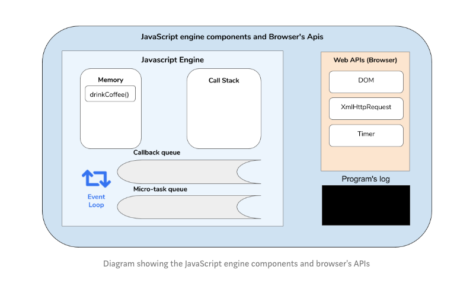
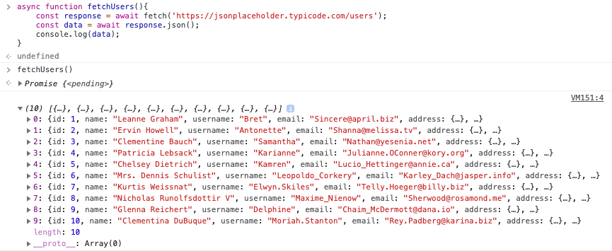
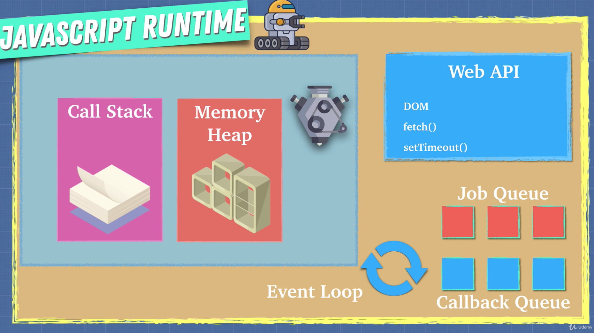
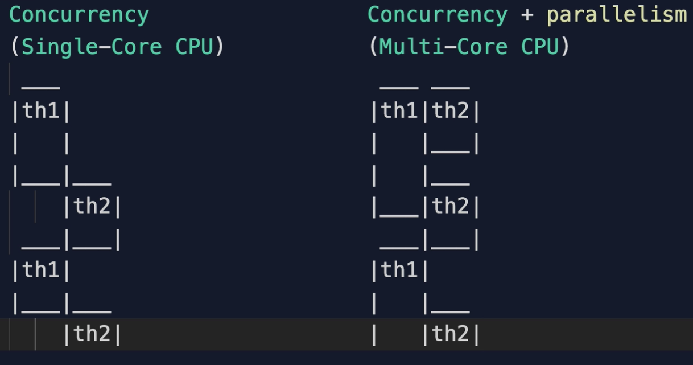

# Asynchronous JavaScript

Asynchronous programming refers to the occurrence of events independently of the main program flow. It is a means of parallel programming in which a unit of work runs separately from the main application thread and then notifies the calling thread of its completion, failure or progress. An example would be a program making a request to a third-party API over the web and then waiting for it to return some data. Simply put, asynchronous functions are just functions that can be executed later.

In multi-threaded programming languages (like Java or C#) asynchronous code is run on separate threads in parallel with the main program flow. This is not the case with JavaScript. JavaScript is single threaded, meaning all code is executed in a sequence, not in parallel.

The web browser or NodeJs allows us to use asynchronous code so we can interact with things outside the world of JavaScript. This is handled by using what is called an “asynchronous non-blocking I/O model”. What that means is that while the normal execution of JavaScript is blocking, I/O operations are not. I/O operations can be fetching data over the internet with Ajax requests or over WebSocket connections, querying data from a database such as MongoDB or accessing the filesystem with the NodeJs “fs” module. All these kind of operations are done in parallel to the execution of the main program flow and it is not JavaScript that does these operations; to put it simply, the underlying JS engine does it.

---

<br>

## How Does the Browser Execute Asynchronous Code?



As we know, the JavaScript engine is single-threaded. This means that only one command can be performed at the same time. The design of JavaScript is based on that.

- “Memory Heap” is where functions and variables are allocated.
- “Call stack” is used by the JavaScript engine to know what code to execute next. Whatever is on the top of the stack is what is currently being executed.
- The “Event Loop” checks on the job queues and, whenever the call stack is empty, pops the code from them and pushes it onto the call stack to be executed.

The two queues that handle asynchronous code:

- The callback queue.
- The micro-task queue - which is used by promises.

## JavaScript's Execution

There are two parts to the code’s execution process.

### The thread of execution

<i>Also called the first half of the program.</i>

It's the first parsing and executing the code line-by-line, as the code appears. It allocates variables and functions, and the code is executed in an execution context. (This part is executed synchronously)

### Deferred code execution

<i>Also called the second half of the program.</i>

This code is executed at some point in time after we have gone through the normal thread of execution. This happens, for example, if we call `setTimeout`, or wait for API request data to come back from a server. We shouldn't block the JavaScript thread of execution in the time we wait.

### Web APIs

The browser provides some features that contribute to the execution of asynchronous code without blocking the thread. These features are known as web APIs (browser). You might recognize several of them, like the timer, where the `setTimeout` and `setInterval` methods live, the `XMLHttpRequest` which is used by the fetch method, the Console API, the DOM, and the web storage API.

### Summary

So once our JavaScript engine sees something that is asynchronous it sends it over to the Web API which deals with it in the background. When it's done with whatever it is processing it will add the callback or the function that needs to be invoked to the callback queue. The event loop will then check to see if the call stack is empty, and the entire JavaScript file has been read. If it's empty it then pushes the asynchronous code onto the call stack.

<br>

# Callbacks vs Promises

## Callbacks

For JavaScript to know when an asynchronous operation has a result (a result being either returned data or an error that occurred during the operation), it points to a function that will be executed once that result is ready. This function is what we call a “callback function”. Meanwhile, JavaScript continues its normal execution of code. Registering a middleware in an express web server with “server.use” is an example of a common API that uses callbacks.

Here is an example of fetching data from a URL using a module called “request”:

```javascript
const request = require(‘request’);

request('https://www.example.com', function (error, response, body) {
  if(error){
    // Handle error.
  }
  else {
    // Successful, do something with the result.
  }
});
```

As you can see, `request` takes a function as its last argument. This function is not executed together with the code above. It is saved to be executed later once the underlying I/O operation HTTP request is done. The underlying HTTP request is an asynchronous operation and does not block the execution of the rest of the JavaScript code. The callback function is put on the “event loop" queue until it's ready to be executed with a result from the request.

## Callback hell

Callbacks are a good way to declare what will happen once an I/O operation has a result, but what if you want to use that data in order to make another request? You can only handle the result of the request within the callback function provided.

In this example the variable “result” will not have a value when printed to the console at the last line:
const request = require(‘request’);
let result;

```javascript
const request = require(‘request’);

let result;

request('http://www.example.com', function (error, response, body) {
    if(error){
        // Handle error.
    }
    else {
        result = body;
    }
});

console.log(result);
```

In this example the variable “result” will not have a value when printed to the console. It will output "undefined" to the console because at the time that line is executed the callback has not yet been called. This is because of the nature of the non-blocking I/O model in JavaScript.

So if we want to do a second request based on the result of the first one, we have to do it inside the callback function of the first request because that is where the result will be available:

```javascript
request("http://www.example.com", function(
  firstError,
  firstResponse,
  firstBody
) {
  if (firstError) {
    // Handle error.
  } else {
    request(`http://www.example.com/${firstBody.someValue}`, function(
      secondError,
      secondResponse,
      secondBody
    ) {
      if (secondError) {
        // Handle error.
      } else {
        // Use secondBody for something
      }
    });
  }
});
```

When you have a callback inside a callback like this, the code tends to get messy. In some cases you may have a callback in a callback in a callback in a callback, and so on.

One thing to note here is the first argument in every callback function will contain an error if something went wrong, or will be empty if all went well. This pattern is called “error first callbacks” and is very common. It is the standard pattern for callback-based APIs in NodeJs. This means that for every callback declared we need to check if there is an error and that just adds to the mess when dealing with nested callbacks.

This is the anti-pattern that has been aptly named “callback hell”.

---

## Promises

A promise is an object that wraps an asynchronous operation and notifies when it’s done. This sounds exactly like callbacks, but the important differences are in the usage of Promises. Instead of providing a callback, a promise has its own methods which you call to tell the promise what will happen when it is successful or when it fails. The methods a promise provides are `then()` for when a successful result is available and `catch()` for when something went wrong.

A promise may produce a single value sometime in the future, either a resolved value or a reason why it didn't resolve (rejected). A promise may be in one of three possible states: Fulfilled, rejected or pending.

```javascript
// function that returns a promise
someAsyncOperation(someParams)
  .then(function(result) {
    // Do something with the result
  })

  .catch(function(error) {
    // Handle error
  });
```

The true power of promises is revealed when you have several asynchronous operations that depend on the results of each other. "Axios" is a model which is similar to "request", but it uses promises instead of callbacks.

Using axios, our callback hell example would look like this:

```javascript
const axios = require(‘axios’);


axios.get(‘http://www.example.com')

.then(function (response) { // Reponse being the result of the first request
    // Returns another promise to the next .then() in the chain
    return axios.get(`http://www.example.com/${response.someValue}`);
})

.then(function response { // Reponse being the result of the second request
    // Handle response
})

.catch(function (error) {
    // Handle error.
});
```

Instead of nesting callbacks inside callbacks inside callbacks, you chain `.then()` calls together making it more readable and easier to follow. Every `.then()` should either return a new Promise or just a value or object which will be passed to the next `.then()` in the chain. Another important thing to notice is that even though we are doing two different asynchronous requests we only have one `.catch()` where we handle our errors. That’s because any error that occurs in the Promise chain will stop further execution and an error will end up in the next `.catch()` in the chain.

It is important to remember that promises are still asynchronous operations, so subsequent `.then()` calls are only executed when the request has finished. This means you cannot access any variables passed to or declared in the Promise chain outside the Promise. The same goes for errors thrown in the Promise chain. You must also have at least one `.catch()` at the end of your Promise chain for you to be able to handle errors that occur. If you do not have a `.catch()`, any errors will silently go un-noticed and you will have no idea why your Promise does not behave as expected.

## Creating promises

Callbacks are not interchangeable with Promises. This means that callback-based APIs cannot be used as Promises. The main difference with callback-based APIs is that they do not return a value, they just execute the callback with the result. A Promise-based API, on the other hand, immediately returns a Promise that wraps the asynchronous operation. Then the caller uses the returned Promise object and calls `.then()` and `.catch()` on it to declare what will happen when the operations has finished.

The process of wrapping a callback based asynchronous function inside a Promise and returning that promise instead is called “promisification”. We are “promisifying” a callback-based function. Since NodeJs version 8 there is a built in a helper called “util.promisify” for doing exactly that:

```javascript
const { promisify } = require(‘util’);

const getAsyncData = promisify(getData);

getAsyncData(“someValue”)
.then(function(result){
    // Do stuff
})
.catch(function(error){
    // Handle error
});
```

---

## Async/Await

Async/Await is the next step in the evolution of handling asynchronous operations in JavaScript. It is part of ES8 and is built on top of promises. It gives you two new keywords to use in your code: `async` and `await`. Async is for declaring that a function will handle asynchronous operations and await is used to declare that we want to await the result of an asynchronous operation inside a function that has the async keyword. An async function is a function that returns a promise. The benefit of async await is that it makes code easier to read by appearing to be more synchronous.

A basic example of using async/await looks like this:

```javascript
async function getSomeAsyncData(value) {
  const firstResult = await fetchTheData(someUrl, value);
  const secondResult = await fetchMoreData(someUrl, value);
  return result;
}
```

A function call can only have the `await` keyword if the function being called is “awaitable”. A function is “awaitable” if it has the `async` keyword or if it returns a Promise.

The `await` keyword will pause the parent function until a response comes back. And you can assign an `await` function to a variable which will contain the result after it resolves.

```javascript
async function fetchUsers() {
  const response = await fetch("https://jsonplaceholder.typicode.com/users");
  const data = await response.json();
  console.log(data);
}

fetchUsers();
```



<i>The same way of achieving this with a Promise would be as follows:</i>

```javascript
fetch("https://jsonplaceholder.typicode.com/users")
  .then(resp => resp.json())
  .then(console.log);
```

Functions with the `async` keyword are interchangeable with functions that return Promises:

```javascript
function fetchTheData(someValue) {
  return new Promise(function(resolve, reject) {
    getData(someValue, function(error, result) {
      if (error) {
        reject(error);
      } else {
        resolve(resutl);
      }
    });
  });
}

async function getSomeAsyncData(value) {
  const result = await fetchTheData(value);
  return result;
}
```

You can loop through several requests in one async await function. And remember, we can also return a promise.
Here we are using a function expression and ES6 destructuring.

```javascript
const urls = [
  "https://jsonplaceholder.typicode.com/users",
  "https://jsonplaceholder.typicode.com/posts",
  "https://jsonplaceholder.typicode.com/albums"
];

const getData = async function() {
  const [users, posts, albums] = await Promise.all(
    urls.map(url => fetch(url).then(resp => resp.json()))
  );
  console.log("users", users);
  console.log("posts", posts);
  console.log("albums", albums);
};

getData();
```

## Error handling with async/await

Inside the scope of an async function you can use try/catch for error handling and even though you await an asynchronous operation, any errors will end up in that catch block:

```javascript
async function getSomeData(value) {
  try {
    const result = await fetchTheData(value);
    return result;
  } catch (error) {
    // Handle error
  }
}
```

As with a Promise chain, where you only need one `.catch()` even if you are doing several asynchronous calls, with async/await you only need to surround the code in the “first” async function with try catch. That function can await one or more other async functions which in return does their own asynchronous calls by awaiting one or more other async functions etc.

```javascript
async function fetchTheFirstData(value) {
  return await get("someUrl", value);
}

async function fetchTheSecondData(value) {
  return await getFromDatabase(value);
}

async function getSomeData(value) {
  try {
    const firstResult = await fetchTheFirstData(value);
    const result = await fetchTheSecondData(firstResult.someValue);
    return result;
  } catch (error) {
    // Every error thrown in the whole “awaitable” chain will end up here.
  }
}
```

It is important to remember that although async/await may make your asynchronous calls look more synchronous, it is still executed with asynchronous I/O operations. Therefore the code handling the responses in the async functions will not be executed until that asynchronous operation has a result.

Also, async/await still resolves as a Promise in the top level of your program, because `async` and `await` are just syntactical sugar for automatically creating, returning and resolving Promises.

[Resource](https://medium.com/codebuddies/getting-to-know-asynchronous-javascript-callbacks-promises-and-async-await-17e0673281ee)

---

<br>

## ES9

In ES9 the Rest/Spread operator has been extended to work with Objects. To better understand this let's first look at the `rest` and `spread` operators in the context of array destructuring and array literals.

<br>

### Array Destructuring

As part of ES6, we introduced a new operator in array destructuring - the `rest` operator `...`

When destructuring an array, the `rest` operator combines the remaining elements of an array into a variable.

<i>Example:</i>

```javascript
let [x, ...remaining] = [1, 2, 3, 4, 5];

console.log(x); // -> 1
console.log(remaining); // -> [2,3,4,5]
```

This uses destructuring assignment to assign the first element to "x" and all the others to "remaining". Note: "remaining" can be called anything.

### Array Literals

Also as part of ES6, we introduced a new operator in array literals - the `spread` operator `...`

When initializing an array - the `spread` operator copies the elements of an existing array into a new array.

<i>Example:</i>

```javascript
let existingArray = [2, 3, 4, 5];
let newArray = [1, ...existingArray];

console.log(newArray); // [1, 2, 3, 4]
```

We initialize a new array with the value `1` and all the elements of "existingArray".

<br>

### Object Destructuring

Similarly to arrays - when destructuring an object, the `rest` operator combines the remaining enumerable properties of that object into a new object, without those which weren’t already picked off by the destructuring pattern.

```javascript
let { x, a, ...remaining } = { x: 1, a: 2, b: 3, c: 4, d: 5 };

console.log(x); // -> 1
console.log(remaining); // -> {b: 3, c: 4, d: 5}
```

We use destructuring assignment to assign the value of “x” property into x, "a" property into a, and all the other properties into an object called "remaining".

### Object Literals

Similarly to arrays - when initializing an object, the `spread` operator copies the enumerable properties of an existing object into the new object:

```javascript
let existingObject = { x: 1, a: 2, b: 3 };
let newObject = { ...existingObject, foo: () => {} };

console.log(newObject); // {x: 1, a: 2, b: 3, foo: ƒ}
```

<br>

### Finally

The `finally()` method allows us to do something once a promise has finished, regardless of whether the `.then` runs or if the promise errors and the `.catch` runs. 

The `finally()` method returns a Promise. When the promise is settled, i.e either resolved or rejected, the specified callback function is executed. It is usually added at the end of the promise.

This helps to avoid duplicating code in both the promise's `then()` and `catch()` handlers.

<i>Example:</i>

In this example the promise resolves and then the `.finally` executes:

```javascript
const urls = [
    'https://swapi.co/api/people/1',
    'https://swapi.co/api/people/2',
    'https://swapi.co/api/people/3',
    'https://swapi.co/api/people/4'
]

Promise.all(urls.map(url => {
    return fetch(url).then(people => people.json())
}))
    .then(array => {
        console.log('1', array[0])
        console.log('2', array[0])
        console.log('3', array[0])
        console.log('4', array[0])
    })
    .catch(err => console.log('Uh oh, im broken!', err))
    .finally(() => console.log('Do something at the end'));

    // -> 1 {name: "Luke Skywalker", height: "172"}...
    // -> 'Do something at the end'
```
In this example the promise rejects and then the `.finally` executes:

```javascript
const urls = [
    'https://swapi.co/api/people/1',
    'https://swapi.co/api/people/2',
    'https://swapi.co/api/people/3',
    'https://swapi.co/api/people/4'
]

Promise.all(urls.map(url => {
    return fetch(url).then(people => people.json())
}))
    .then(array => {
        throw Error;
        console.log('1', array[0])
        console.log('2', array[0])
        console.log('3', array[0])
        console.log('4', array[0])
    })
    .catch(err => console.log('Uh oh, im broken!', err))
    .finally(() => console.log('Do something at the end'));

    // -> 'Uh oh, im broken!'
    // -> 'Do something at the end'
```

<br>

### For await of

The `for await...of` statement creates a loop iterating over async iterable objects. It takes each item from an array of promises and returns all of the responses in the correct order.

```javascript
const urls = [
  "https://jsonplaceholder.typicode.com/users",
  "https://jsonplaceholder.typicode.com/posts",
  "https://jsonplaceholder.typicode.com/albums"
];
```

In this first example, we're simply declaring an array with 3 values and then assigning the response for each request to those values:

```javascript
const getData = async function() {
    try {
        const [ users, posts, albums ] = await Promise.all(urls.map(async function(url) {
            const response = await fetch(url);
            return response.json();
        }));

        console.log("users", users)
        console.log("posts", posts)
        console.log("albums", albums)
        
    } catch(err) {
        console.log('oops', err)
    }
}
```

However in this next example, we're using the `for await...of` statement to loop through each request and extract the data, almost as if it were synchronous code:

```javascript
const getData2 = async function() {
    
    // firstly we create an array of fetch promises for each of the above url requests
    const arrayOfPromises = urls.map(url => fetch(url));

    // next we can use the 'for await of' to loop through each request
    for await (let request of arrayOfPromises) {
        
        // and we will extract the data from each request
        const data = await request.json();
        console.log(data);
    }
}
```

So both examples will return the same results:

```javascript
// -> Users (10) [{…}, {…}, {…}...]
// -> Posts (100) [{…}, {…}, {…}...]
// -> Albums (100) [{…}, {…}, {…}...]
```
<br>

### Job Queue



As of ES6 browsers have introduced the “Job Queue” (or micro-task queue) to the JavaScript Runtime to accommodate the addition of Promises. 

Because we now have the ability to natively handle asynchronous code using promises (instead of only using callbacks previously) the Job Queue was created in addition to the Callback Queue (or task queue). 

The Job Queue is similar to the Callback Queue. It is smaller than the Callback Queue but it has a higher priority, meaning the Event Loop will check the Job Queue first and make sure it's empty before proceeding to the Callback Queue.

<i>Example:</i>

```javascript
// callback queue (task queue)
setTimeout(()=> { console.log('I am in the callback queue')}, 5)

// job queue (micro-task queue)
Promise.resolve('Hi').then((data) => console.log(data, 'I am in the job queue'))

// regular synchronous code
console.log('I am regular synchronous code')
```

To explain this, the above example will return in the order as follows:

```javascript
// -> I am regular synchronous code
// -> Hi I am in the job queue
// -> I am in the callback queue
```

<br>

### Parallel, Sequence, Race

There are three main ways of managing promises:

<i>Example:</i>

```javascript
const promisify = (item, delay) =>
  new Promise((resolve) => 
    setTimeout(() =>
      resolve(item), delay
    ));

const a = () => promisify('a', 100);
const b = () => promisify('b', 5000);
const c = () => promisify('c', 3000);
```

#### Parallel

Run them all at the same time.

```javascript
async function parallel() {
  
  const promises = [a(), b(), c()];
  const [output1, output2, output3] = await Promise.all(promises);

  return `parallel is done: ${output1} ${output2} ${output3}`
}

parallel().then(console.log);

// -> Promise {<pending>} ...
// -> parallel is done: a b c
```

#### Sequential

Run them in an order, one by one.

```javascript
async function sequence() {

  const output1 = await a();
  const output2 = await b();
  const output3 = await c();

  return `sequence is done: ${output1} ${output2} ${output3}`
}

sequence().then(console.log);

// -> Promise {<pending>} ...
// -> sequence is done: a b c
```

#### Race

Run them all but only return the one that resolved first.

```javascript
async function race() {

  const promises = [a(), b(), c()];
  const output1 = await Promise.race(promises);

  return `race is done: ${output1}`;
}

race().then(console.log);

// -> Promise {<pending>} ...
// -> race is done: a
```

And if we run them all three async functions together we can see which order they resolve in:

```javascript
parallel().then(console.log);
sequence().then(console.log);
race().then(console.log);

// -> Promise {<pending>} ...
// -> race is done: a
// -> parallel is done: a b c
// -> sequence is done: a b c
```
<br>

### Threads

As we know, JavaScript is a single threaded language, but with it's asynchronous ability we can run tasks in background threads outside of JavaScript so that they don't affect the main thread. For example, when you open a new browser tab, the browser creates a new thread for that tab with its own JS call stack and memory heap. Then when you close that tab, the thread is destroyed. 

In node.js background tasks can be handed off to worker threads which are part of the Libuv library.


In the browser, background tasks can be handed off to Web Workers - which are just separate JavaScript programs running on different threads in parallel to the main thread. 

### Concurrency and Parallelism



Even though JavaScript is single threaded, concurrency is something that can be achieved by doing things in the background on different threads, such as with Node.js or a web browser. But these can only run once the main call stack is complete. 

Running more than one thread at a time is referred to as parallelism. Parallelism isn't built into the JavaScript language, but it is achieved with node.js by running separate instances on each of your CPU's cores.