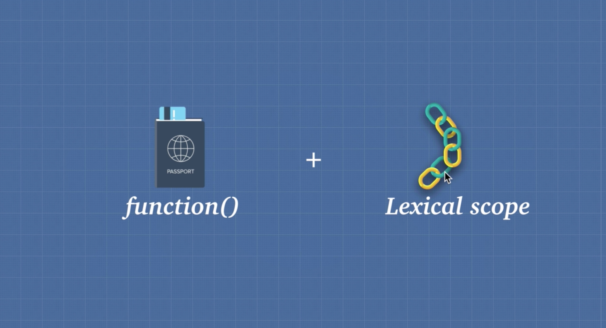
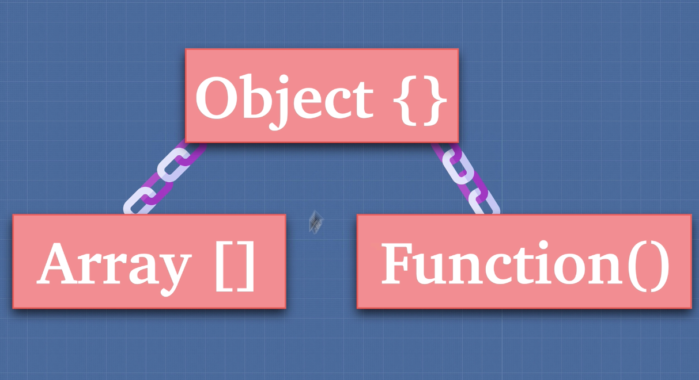
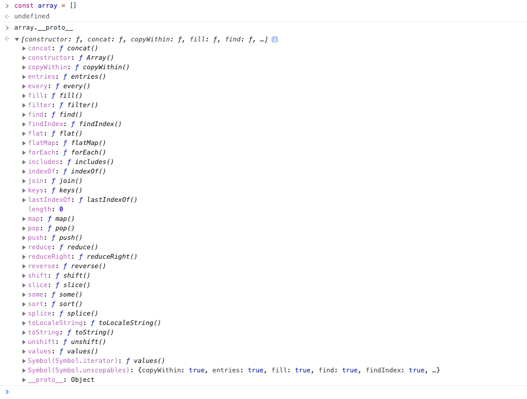
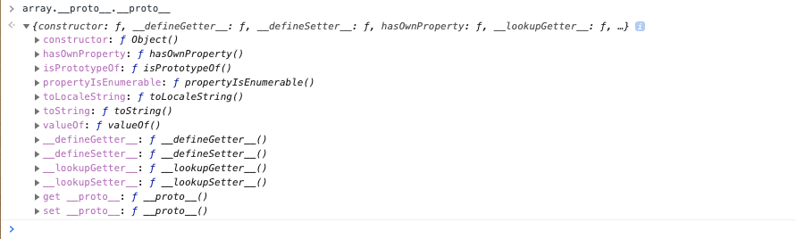
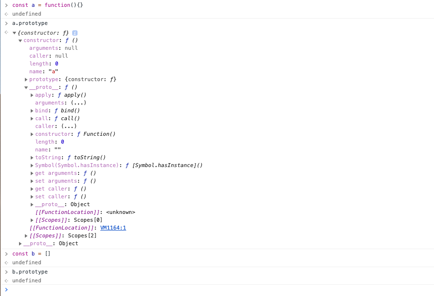
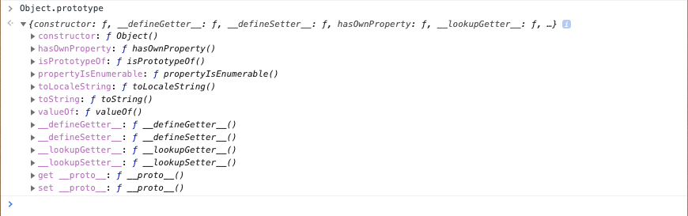
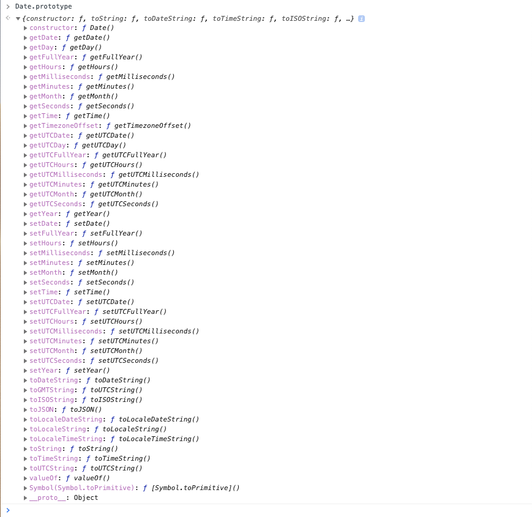
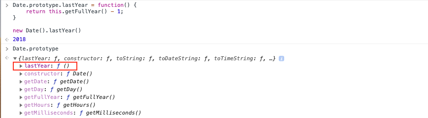

# Closures and Prototypal Inheritance

## Functions are first class citizens

- Functions can be assigned to variables and properties of objects.

```javascript
const stuff = function() {};
```

- You can pass functions as arguments into a function.

```javascript
function something(fn) {
  fn();
}

something(function() {
  console.log("hi");
}); // -> 'hi'
```

- You can return functions as values from other functions.

```javascript
function a() {
  return function b() {
    console.log("bye");
  };
}

a()(); // -> 'bye'
```
---
## Higher Order Functions


Higher order functions are simply functions that can take a function as an argument, or a function that returns another function.

<i>Example:</i>

```javascript
const giveAccessTo = (name) => 'Access granted to ' + name

function authenticate(verify) {
  let array = [];
  for (let i = 0; i < verify; i++) {
    array.push(i);
  }
  return true;
}

function letUser(user, fn) {
  if (user.level === 'admin') {
    fn(500000)
  } else if (user.level === 'general') {
    fn(100000)
  }
  return giveAccessTo(user.name);
}

letUser({level: 'general', name: 'Corey'}, authenticate); // -> "Access granted to Corey"
```

<i>Example:</i>

```javascript
const multiplyBy = (num1) => (num2) => num1 * num2

multiplyBy(5)(3); // -> 15

const multiplyByTwo = multiplyBy(2);
multiplyByTwo(5); // -> 10
```
---
## Closures

Closures allow a function to access variables from an enclosing scope or outer scope environment even after it leaves the scope in which it was declared because all that matters in Javascript is where the function was written.



We have these things called closures in JavaScript because of two things that we get. One is the fact that in JavaScript functions are a first class citizen, we can pass them around like data of any other type.

We also have this idea of lexical scope, that is the JavaScript engine knows based on where our code is written before we even run the code what variables each function has access to. 

Closure is simply a combination of function and the lexical environment from which it was declared. Closures allow a function to access variables from an enclosing scope or environment even after it leaves the scope in which it was declared.

<i>Example:</i>

```javascript
function a() {
  const grandpa = 'John'
  return function b() {
    const father = 'Simon'
    return function c() {
      const son = 'Luke'
      return `${grandpa} ${father} ${son}`
    }
  }
}

a()()() // -> "John Simon Luke"
```

Closure is a feature of JavaScript where the JavaScript engine will make sure that the function has access to all of the variables contained in other functions in which it's nested in.

<i>Example using an arrow function:</i>

```javascript
const family = (grandpa) => (father) => (son) => `${grandpa} ${father} ${son}`

family('John')('Simon')('Luke') // -> "John Simon Luke"
```

## Two main benefits of closures:

### 1. Memory efficiency

<i>Example without using a closure:</i>

```javascript
function heavyDuty(index) {
  const bigArray = new Array(5000).fill('hi');
  console.log('func ran');
  return bigArray[index];
}

heavyDuty(426);
heavyDuty(2094);
heavyDuty(3421);

// ->
// func ran
// func ran
// func ran
// hi
```

<i>Same example but using a closure:</i>

```javascript
function heavyDuty() {
  const bigArray = new Array(5000).fill('hi');
  console.log('func ran');
  return function(index) {
    return bigArray[index];
  }
}

const getHeavyDuty = heavyDuty();

getHeavyDuty(745);
getHeavyDuty(2734);
getHeavyDuty(4711);

// ->
// func ran
// hi
```

In the first example, `heavyDuty()` was created three times compared to the second example where by using closures `bigArray` was only created once because we knew we were going to access it a lot. We just maintained that closure scope over it and we were able to call it over and over without doing all that creation/destruction work from the memory heap. 

### 2. Encapsulation

```javascript
const makeNuclearButton = () => {

  let timeWithoutDestruction = 0;
  const passTime = () => timeWithoutDestruction ++;
  const totalPeaceTime = () => timeWithoutDestruction;

  const launch = () => {
    timeWithoutDestruction = -1;
    return 'kaboom';
  }

  setInterval(passTime, 1000)

  return {
    totalPeaceTime: totalPeaceTime
  }

}

const tryDetonate = makeNuclearButton();

tryDetonate.launch(); // -> won't work, can't access due to encapsulation

tryDetonate.totalPeaceTime(); // -> does work, will print elapsed time
```

Data encapsulation in relation to closures refers to the idea of removing access to certain data which shouldn't be accessible to a user. In the example above the user is able to interact with the `totalPeaceTime` function but they can't access the `launch` function. This is because the `launch` function is not being returned in the scoped `makeNuclearButton` function.

<br>

---
## Prototypal Inheritance

Inheritance is when an object gets access to the properties and methods of another object. 

#### Why is prototypal inheritance useful?

The fact that objects can share prototypes means that you can have objects with properties that are pointing to the same place in memory without the need to repeat code, thus being more efficient.



The chains in this diagram represent prototypal inheritance. Arrays and functions in JavaScript get access to the methods and properties of objects.



Here we created an array, and by appending `.__proto__` we can go up the prototype chain and view the array constructor. 



By appending another `.__proto__` we can go up the chain another level and view the object constructor.

---
<br>

### Manually creating a prototype chain

#### Note: You should never use `__proto__` to manually assign the prototype chain yourself (like in this example). It will conflict with the compiler and cause performance issues. The purpose of this is to simply explain how it works.

<i>Example:</i>

```javascript
let dragon = {
  name: 'Fred',
  fire: true,
  fight() {
    return 5
  },
  roar(){
    if (this.fire) {
      return `I am ${this.name}, the breather of fire.`
    }
  }
}

let lizard = {
  name: 'Larry',
  fight() {
    return 1
  }
}

lizard.__proto__ = dragon;

lizard.roar() // -> "I am Larry, the breather of fire"
lizard.fire // -> true
lizard.fight() // -> 1

dragon.isPrototypeOf(lizard) // -> true
```

Here lizard is inheriting all the properties and methods of dragon through a prototype chain and is then overriding some attributes in it's own object declaration. 

```javascript
for (let prop in lizard) {
  console.log(prop) // -> name, fight, fire, roar
}
```

Here we're looping through all of lizard's properties and logging them out.

```javascript
for (let prop in lizard) {
  if (lizard.hasOwnProperty(prop)) {
  console.log(prop) // -> name, fight
  }
}
```

Here we're looping through all of lizard's properties, filtering them with the `hasOwnProperty()` method and logging out only it's own (non-inherited) properties.

---
<br>

### Inheritance using `Object.create()`

<i>Example:</i>

```javascript
let iphone11 = {
  wirelessCharging: true
}

let iphone11Pro = Object.create(iphone11)

iphone11Pro.wirelessCharging // -> true
```

Here we're creating inheritance using `Object.create()`

---
<br>

### Only functions have the `.prototype` property



Every function has a prototype property and it references to an object used to attach properties that will be inherited by objects further down the prototype chain. 

The last object in the chain is this built in `Object.prototype`.



`Object` is a function because it has the prototype property. The `Object.prototype` is what we call the base object. That's the very last piece or the very last object that we can look for properties on before we point to null.

---
<br>

### Exercise:
#### Extend the functionality of the built-in `Date` object by creating your own method which prints the previous year of a given date.



These are all the built-in methods we can use with the `Date` object.

<i>Solution:</i>

```javascript
Date.prototype.lastYear = function() {
    return this.getFullYear() - 1;
}

new Date().lastYear() // -> 2018
```



Now if we run `Date.prototype` we see our new function appears in the list of methods. 

---
<br>


### Exercise:
#### Extend the functionality of the built-in `Array` object by creating your own method which appends an exclamation mark to each value of an array.

<i>Solution:</i>

```javascript
Array.prototype.emphasise = function() {
  let arr = [];
  for( let i = 0; i < this.length; i++ ) {
    arr.push((this[i] + '!'))
  }
  return arr
}

[1,2,3].emphasise() // -> ["1!", "2!", "3!"]
```

<i>Note: You can't use arrow functions in these solutions because the value of `this` would be lexically scoped to point to the function itself. We need to use a function expression because we want the value of `this` instead to be determined at call time when we actually run the function.</i>