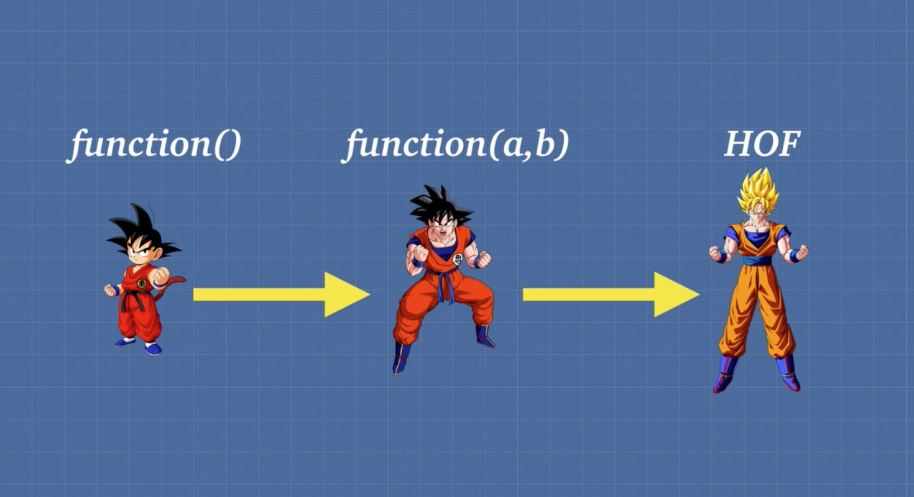

# Closures and Prototypal Inheritance

## Functions are first class citizens

- Functions can be assigned to variables and properties of objects.

```javascript
const stuff = function() {};
```

- You can pass functions as arguments into a function.

```javascript
function something(fn) {
  fn();
}

something(function() {
  console.log("hi");
}); // => 'hi'
```

- You can return functions as values from other functions.

```javascript
function a() {
  return function b() {
    console.log("bye");
  };
}

a()(); // => 'bye'
```
---
## Higher Order Functions



Higher order functions are simply functions that can take a function as an argument, or a function that returns another function.

<i>Example:</i>

```javascript
const giveAccessTo = (name) => 'Access granted to ' + name

function authenticate(verify) {
  let array = [];
  for (let i = 0; i < verify; i++) {
    array.push(i);
  }
  return true;
}

function letUser(user, fn) {
  if (user.level === 'admin') {
    fn(500000)
  } else if (user.level === 'general') {
    fn(100000)
  }
  return giveAccessTo(user.name);
}

letUser({level: 'general', name: 'Corey'}, authenticate); // => "Access granted to Corey"
```

<i>Example:</i>

```javascript
const multiplyBy = (num1) => (num2) => num1 * num2

multiplyBy(5)(3); // => 15

const multiplyByTwo = multiplyBy(2);
multiplyByTwo(5); // => 10
```
---
## Closures


We have these things called closures in JavaScript because of two things that we get. One is the fact that in JavaScript functions are a first class citizen, we can pass them around like data of any other type.

We also have this idea of lexical scope, that is the JavaScript engine knows based on where our code is written before we even run the code what variables each function has access to. 

Closure is simply a combination of function and the lexical environment from which it was declared. Closures allow a function to access variables from an enclosing scope or environment even after it leaves the scope in which it was declared.

<i>Example:</i>

```javascript
function a() {
  const grandpa = 'John'
  return function b() {
    const father = 'Simon'
    return function c() {
      const son = 'Luke'
      return `${grandpa} ${father} ${son}`
    }
  }
}

a()()() // => "John Simon Luke"
```

Closure is a feature of JavaScript where the JavaScript engine will make sure that the function has access to all of the variables contained in other functions in which it's nested in.

<i>Example using an arrow function:</i>

```javascript
const family = (grandpa) => (father) => (son) => `${grandpa} ${father} ${son}`

family('John')('Simon')('Luke') // => "John Simon Luke"
```

## Two main benefits of closures:

### 1. Memory efficiency

<i>Example without using a closure:</i>

```javascript
function heavyDuty(index) {
  const bigArray = new Array(5000).fill('hi');
  console.log('func ran');
  return bigArray[index];
}

heavyDuty(426);
heavyDuty(2094);
heavyDuty(3421);

// =>
// func ran
// func ran
// func ran
// hi
```

<i>Same example but using a closure:</i>

```javascript
function heavyDuty() {
  const bigArray = new Array(5000).fill('hi');
  console.log('func ran');
  return function(index) {
    return bigArray[index];
  }
}

const getHeavyDuty = heavyDuty();

getHeavyDuty(745);
getHeavyDuty(2734);
getHeavyDuty(4711);

// =>
// func ran
// hi
```

In the first example, `heavyDuty()` was created three times compared to the second example where by using closures `bigArray` was only created once because we knew we were going to access it a lot. We just maintained that closure scope over it and we were able to call it over and over without doing all that creation/destruction work from the memory heap. 

### 2. Encapsulation

```javascript
const makeNuclearButton = () => {

  let timeWithoutDestruction = 0;
  const passTime = () => timeWithoutDestruction ++;
  const totalPeaceTime = () => timeWithoutDestruction;

  const launch = () => {
    timeWithoutDestruction = -1;
    return 'kaboom';
  }

  setInterval(passTime, 1000)

  return {
    totalPeaceTime: totalPeaceTime
  }

}

const tryDetonate = makeNuclearButton();

tryDetonate.launch(); // => won't work, can't access due to encapsulation

tryDetonate.totalPeaceTime(); // => does work, will print elapsed time
```

Data encapsulation in relation to closures refers to the idea of removing access to certain data which shouldn't be accessible to a user. In the example above the user is able to interact with the `totalPeaceTime` function but they can't access the `launch` function. This is because the `launch` function is not being returned in the scoped `makeNuclearButton` function.


