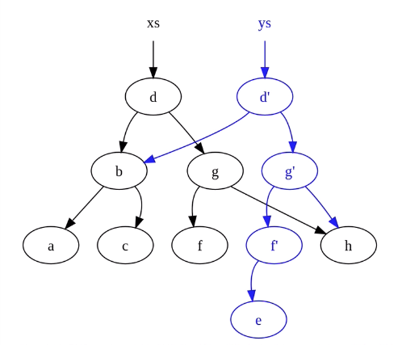
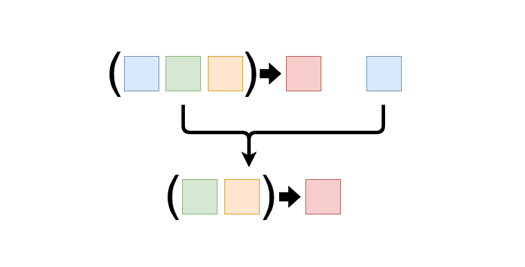

# Functional Programming

Functional programming (often abbreviated FP) is the process of building software by composing pure functions, avoiding shared state, mutable data, and side-effects. Functional programming is declarative rather than imperative, and application state flows through pure functions. Contrast with object oriented programming, where application state is usually shared with methods in objects.

<i>[Reference Article](https://medium.com/javascript-scene/master-the-javascript-interview-what-is-functional-programming-7f218c68b3a0)</i>

## Pure Functions


If you want to break things down in functional programming it all comes down to this concept of pure functions. The idea is that there's a separation between data over a program and the behavior of a program. All objects created in functional programming are immutable, so after it has been created it cannot be changed.

Rules:

- The function has to always return the same output, given the same input
- The function cannot modify anything outside of itself
- No side effects

<i>Example:</i>

```javascript
const array = [1,2,3] // in the outside world (don't modify)

function removeLastItem(arr) {
    const newArray = [].concat(arr); // make a copy of the input instead of directly modifying it
    newArray.pop()
    return newArray
}

function multiplyByTwo(arr) {
    return arr.map(item => item * 2) // using .map() will return a new array
}

const array2 = removeLastItem(array);
const array3 = multiplyByTwo(array);

console.log(array, array2, array3) // ->  [1, 2, 3] , [1, 2] , [2, 4, 6]
```

---
<br>


#### The perfect function should:

- Do one task and one task only
- Have a return statement. If we give it an input we expect an output
- Be pure (see above rules)
- Have no shared state with other functions
- Have immutable state. Never modify global state, always return a new copy of an input
- Be composable
- Be predictable

---
<br>

## Idempotence

The idea of Idempotence is a function that always returns or does what we expect it to do.

<i>Example:</i>

```javascript
function notGood(num) {
    console.log(num)
}

notGood(5) // -> 5
```

This function is idempotent because it returns the same result when called multiple times. It is not pure however as it interacts with the global scope. Practical examples of idempotent functions can be HTTP requests to an API such as deleting a user. Idempotence is useful because it helps keep code predictable.

---
<br>

## Imperative Vs. Declarative

<b>Imperative</b> code is code that tells the machine what to do and how to do it. <b>Declarative</b> code tells it what to do and what should happen.

A useful analogy to think of is that computers are better at being imperative and humans are better at being declarative. 


Machine code is imperative. When we declare a variable the computer receives specific instructions related to where it should be stored in memory space, when to modify it and so on. Its very descriptive about how to do things. In contrast, as we go higher up the chain to higher level languages it becomes more declarative. Instead of giving specific instructions, we just declare the variable with some sort of data and tell it what we need to achieve but not how to do it. The computer takes care of that for us.

<i>JQuery is an example of a fairy imperative language, and the React framework operates in a fairly declarative fashion.</i>

<i>Example:</i>

`for` loops can be considered an imperative style of writing code

```javascript
for (let i = 0; i < 1000; i++) {
    console.log(i) // -> 1,2,3,4...1000
}
```

One way of making a `for` loop more declarative is to use `forEach()` instead

```javascript
[1,2,3].forEach(item => console.log(item)) // -> 1,2,3
```
<br>

### <i>Functional programming teaches us be more declarative.</i>
---
<br>

## Immutability

In functional programming, immutability relates to not changing data or state but instead making copies of it and returning a new state every time. 

Doesn't that just fill up our memory? That's where structural sharing comes in.

### Structural Sharing



When a new copy of a datatype (object, array etc) is created instead of copying everything only the changes made to the state are copied. This saves memory. 

---
<br>

## Higher Order Functions

A higher order function is a function that does one of two things. It either (1) takes one or more functions as arguments, or (2) returns a function as a result, often called a callback.

<i>Example 1:</i>

```javascript
const hof = () => () => 'hello';

hof() // -> Function () => 'hello'

hof()() // -> hello
```

<i>Example 2:</i>

```javascript
const hof = (fn) => fn('hello');

hof(function(x){ console.log(x) }) // -> hello
```

---
<br>

## Currying

Currying is when you break down a function that takes multiple arguments into a series of functions that each take only one argument.

<i>Example</i>

```javascript
const multiply = (a,b) => a * b;
```

Instead of this function taking two parameters, we're going to give the first function one parameter which returns another function, and that function will take another parameter which will multiply `a` with `b`. Because of closures we can access the `a` variable inside of the `b` function. 

```javascript
const curriedMultiply = (a) => (b) => a * b;

curriedMultiply(5)(4); // -> 20
```

### Why is this useful?

You can now create additional utility functions ontop of this function. So you can see that in this example we're essentially saving the first function with a set argument passed into the parameter to a new variable. Then when we can use that variable as a new function which only takes an input for the second function. 

```javascript
const curriedMultiplyBy5 = curriedMultiply(5);

curriedMultiplyBy5(6) // -> 30
curriedMultiplyBy5(10) // -> 50
```

<br>

## Partial Application



Partial Application is a technique of fixing a number of arguments to a function, then producing another function of smaller arguments i.e binding values to one or more of those arguments, and using closures to later be called with the rest of the arguments.

```javascript
function addition(x, y) {
   return x + y;
}

const plus5 = addition.bind(null, 5)

plus5(10) // -> 15
```

<i>Note: this value does not matter for the (non-method) function addition which is why it is null above.</i>

<br>

### Difference between Currying & Partial Application

- Currying always produces nested unary (1-ary) functions. The transformed function is still largely the same as the original.
- Partial application produces functions of arbitrary number of arguments. The transformed function is different from the original — it needs less arguments.

---
<br>

## Difference between Parameters & Arguments

Function parameters are placeholders that are used to access data input (arguments) to that function. The following function defines two parameters `x` and `y`:

```javascript
function addition(x, y) {
   return x + y;
}
```

Arguments are the actual values passed to a function when the function is called. We can say that function defines parameters and it takes arguments.

```javascript
addition(5,10)
```

### Arity

Arity of a function simply refers to the number of arguments that the function takes.

---
<br>

### Exercise:

Implement a cart feature using functional programming:
1. Add items to cart
2. Add 10% tax to item in cart
3. Buy item: cart --> purchases
4. Empty cart

```javascript
// create our own compose function
const compose = (f,g) => (...args) => f(g(...args));

const user = {
    name: 'Corey',
    active: true,
    cart: [],
    purchases: []
}

const purchaseItem = (...funcs) => funcs.reduce(compose);

purchaseItem(emptyCart, buyItem, applyTax, addToCart)(user, {name: 'laptop', price: 600})

function addToCart(user, item) {
    const updateCart = user.cart.concat(item)
    return Object.assign({}, user, { cart: updateCart })
}

function applyTax(user) {
    const {cart} = user;
    const taxRate = 1.1;
    const updatedCart = cart.map(item => {
        return {
            name: item.name,
            price: item.price * taxRate
        }
    })
    return Object.assign({}, user, { cart: updatedCart })
}

function buyItem(user) {
    return Object.assign({}, user, { purchases: user.cart })
}

function emptyCart(user) {
    return Object.assign({}, user, { cart: [] })
}

// -> { name: 'Corey', active: true, cart: [], purchases: [{ name: 'laptop', price: 660 }]}
```