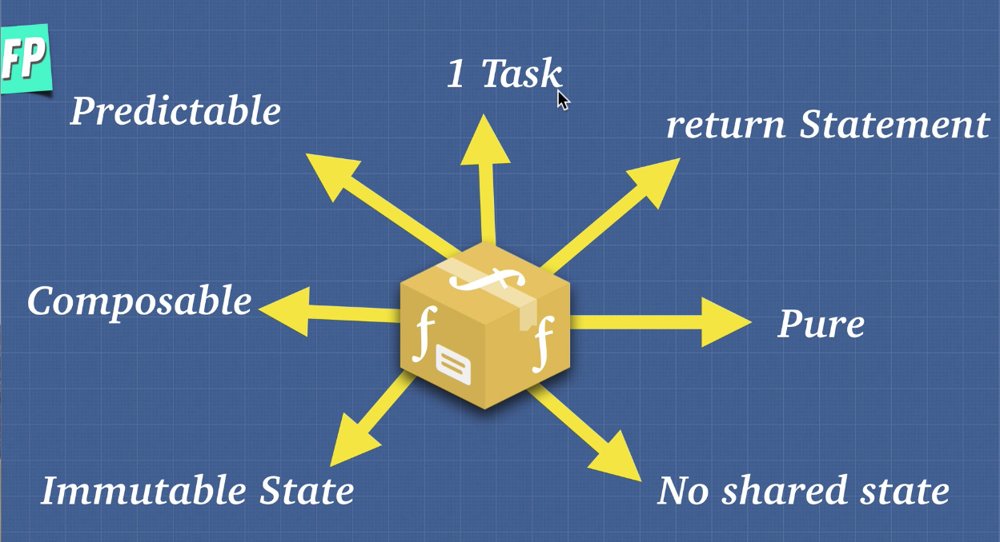
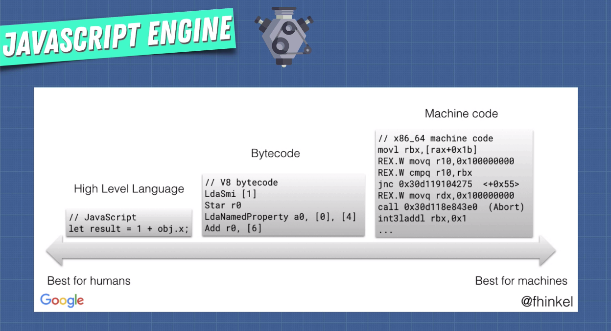

# Functional Programming

Functional programming (often abbreviated FP) is the process of building software by composing pure functions, avoiding shared state, mutable data, and side-effects. Functional programming is declarative rather than imperative, and application state flows through pure functions. Contrast with object oriented programming, where application state is usually shared with methods in objects.

<i>[Reference Article](https://medium.com/javascript-scene/master-the-javascript-interview-what-is-functional-programming-7f218c68b3a0)</i>

## Pure Functions


If you want to break things down in functional programming it all comes down to this concept of pure functions. The idea is that there's a separation between data over a program and the behavior of a program. All objects created in functional programming are immutable, so after it has been created it cannot be changed.

Rules:

- The function has to always return the same output, given the same input
- The function cannot modify anything outside of itself
- No side effects

<i>Example:</i>

```javascript
const array = [1,2,3] // in the outside world (don't modify)

function removeLastItem(arr) {
    const newArray = [].concat(arr); // make a copy of the input instead of directly modifying it
    newArray.pop()
    return newArray
}

function multiplyByTwo(arr) {
    return arr.map(item => item * 2) // using .map() will return a new array
}

const array2 = removeLastItem(array);
const array3 = multiplyByTwo(array);

console.log(array, array2, array3) // ->  [1, 2, 3] , [1, 2] , [2, 4, 6]
```

---
<br>



#### The perfect function should:

- Do one task and one task only
- Have a return statement. If we give it an input we expect an output
- Be pure (see above rules)
- Have no shared state with other functions
- Have immutable state. Never modify global state, always return a new copy of an input
- Be composable
- Be predictable

---
<br>

## Idempotence

The idea of Idempotence is a function that always returns or does what we expect it to do.

<i>Example:</i>

```javascript
function notGood(num) {
    console.log(num)
}

notGood(5) // -> 5
```

This function is idempotent because it returns the same result when called multiple times. It is not pure however as it interacts with the global scope. Practical examples of idempotent functions can be HTTP requests to an API such as deleting a user. Idempotence is useful because it helps keep code predictable.

---
<br>

## Imperative Vs. Declarative

<b>Imperative</b> code is code that tells the machine what to do and how to do it. <b>Declarative</b> code tells it what to do and what should happen.

A useful analogy to think of is that computers are better at being imperative and humans are better at being declarative. 



Machine code is very imperative. When we declare a variable the computer receives a lot of specific instructions on where to put it in which memory space, when to modify it and so on. Its very descriptive of how to do things. In contrast, as we go higher up the chain to a higher level language, it becomes more declarative. Instead of giving specific instructions of where to store it in memory etc, we just declare the variable with some sort of data and tell it what we need to get done but not how to do it. The computer takes care of that for us. 