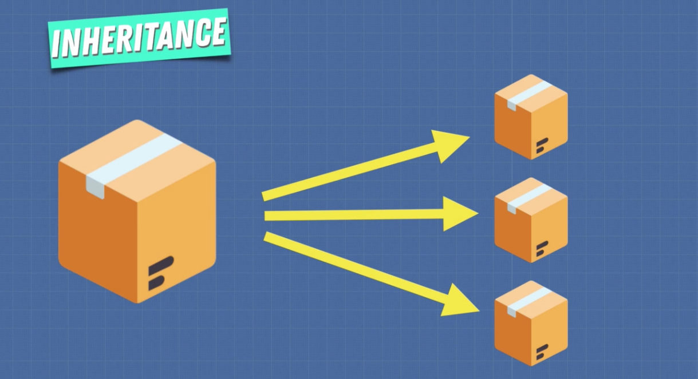
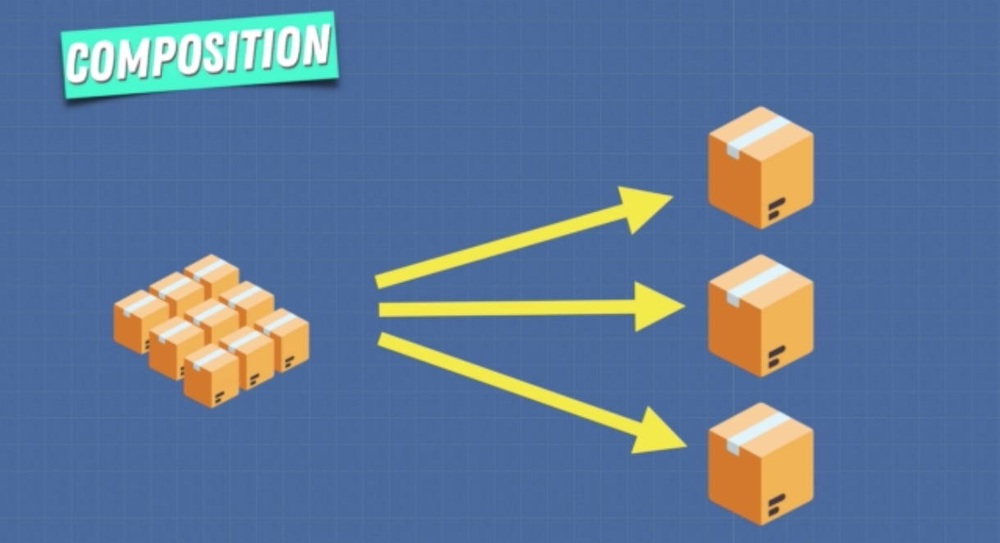

# OOP vs FP

In all programs there are two primary components, *data* and *behaviors*.

Object Oriented Programming says bring together the data and the behavior in a single location called *object* or *class*. This allows us to easier understand our program and be more organized.

Functional Programming says that *data* and *behaviors* are distinctly different things and should be kept separate for clarity.

<br>

## Key Differences

| OOP           | FP            | 
| :------------ |:------------- | 
| Few operations on common data | Many operations on fixed data | 
| **Stateful** - State is modified  | **Stateless** - State is immutable |  
| **Side effects** - Methods manipulate internal state | **Pure** (no side effects) - Functions don't modify outside code | 
| **Imperative** - How we want it done | **Declarative** - What we want to be doing |

<br>

---
<br>

## Inheritance vs Composition

Inheritance is a superclass that is extended to smaller pieces that add or overwrite things. We used this in our OOP example where we had the `elf` and `ogre` classes that extended the functionality of the `character` superclass.

Composition is creating a series of small pieces which collectively create something bigger. We used this in our FP example to compose a series of functions that gave the `purchaseItem` function many different abilities to process data differently. 

Inheritance is when you design your types after what they are, while composition is when you design your types after what they do.

### Issues with Inheritance:

- <b>Fragile base-class & Tight Coupling:</b>
Individual changes made to programs built using inheritance can often create unforseen ripple effects which can break code. For example, you might add in a new function to a base class which will create conflicts with the inheriting sub classes. For this reason it can be difficult to write code which plans for the future using inheritance.

- <b>Hierarchy:</b> 
A range of issues can arise relating the the heirarchy structure of elements using inheritance, particularly when changes are made. For example, new sub classes may by default inherit a heap of properties and data they don't need. It's also difficult to make changes to subclasses' hierarchy once they're set and referencing each other. 

### How can this be fixed with composition?

Instead of defining the attack method inside the character class (like our OOP example) we will create a separate function to give attack to a character. 

```javascript
function getAttack(character) {
    return Object.assign({}, character, { attackFn: () => {} })
}

function Elf(name, weapon, type) {
    let elf = {
        name,
        weapon,
        type
    }
    return getAttack(elf)
}
```

This way we're composing instead of just inheriting. We're giving the elf a set of basic abilities and then adding additional abilities as we like. 

<br>

### To review:

Inheritance is a superclass that is extended to smaller pieces that add or overwrite things.

Although you can be careful with inheritance and make sure that the base class is very general so that you don't overload our subclasses, it can easily get out of hand as you go deeper down the inheritance chain. And once you need to change something it becomes really difficult.



On the other hand composition is about smaller pieces that are combined to create something bigger.

You combine the boxes based on what you need to create the desired output. And if you need to add something later on you just add another box and recompose, and if you don't need something anymore you just simply remove it.  



For this reason it is widely accepted that composition is a better long term solution than inheritance. This doesn't mean that inheritance is always bad. There are ways that you can still write great code with inheritance, but the problems which typically arise, related to predicting future changes, becomes difficult to manage.

So composition is a good tool for you to use when creating software because it helps you create code that is more stable and easier to change in the future.

---
<br>

## To Review

Object oriented programming and functional programming are both paradigms, and a programming paradigm is simply a set of rules and conventions for writing code. For example, organizing code into units would be called Object Oriented Programming. And avoiding side effects and writing pure functions would be called Functional Programming. 

In object oriented programming an object is a box containing information and operations that are supposed to refer to the same concept, grouping it together as an object. These pieces of information inside the object are called attributes or state, and the operations that can happen to the state are known as methods.

In functional programming the code structure is essentially a combination of functions. Data is immutable which leads to writing programs with no side effects, because functions can't change the outside world and the output value of a function simply depends on the given arguments. This allows functional programming to really have control over a program flow.