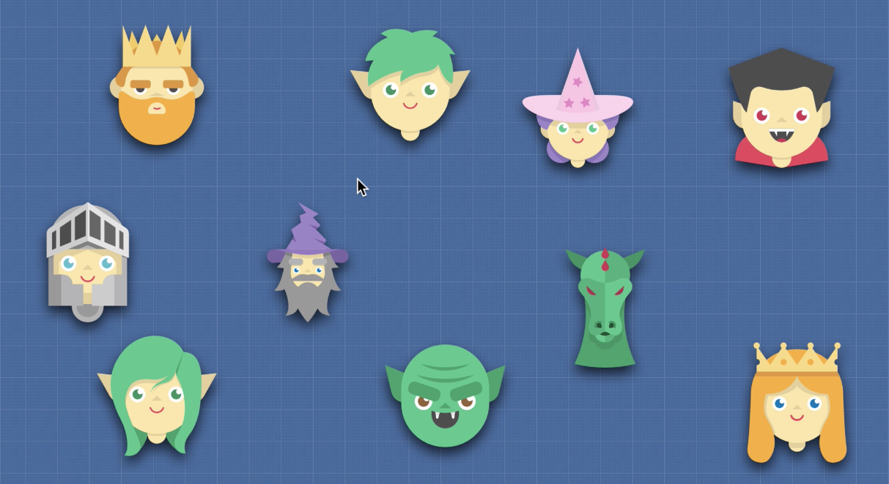

# Object Oriented Programming

Object-oriented programming (OOP) is a programming paradigm based on the concept of "objects". In this way, the data structure becomes an object that includes both data and functions. Data, in the form of fields (often known as attributes or properties), and functions, in the form of procedures (often known as methods). 

A feature of objects is an object's procedures that can access and often modify the data fields of the object with which they are associated (objects have a notion of "this" or "self"). In addition, programmers can create relationships between one object and another. For example, objects can inherit characteristics from other objects.

In OOP, computer programs are designed by making them out of objects that interact with one another. OOP languages are diverse, but the most popular ones are class-based, meaning that objects are instances of classes, which also determine their types.


In OOP an object is a box containing information and operations that are supposed to refer to the same concept. It's like we're modeling real world objects and relationships.

## Class-based vs Prototype-based

When it comes to object oriented programming there are two main types of languages:  

- #### Class based

In class-based languages the classes are defined beforehand and the objects are instantiated based on the classes. If two objects <i>apple</i> and <i>orange</i> are instantiated from the class <i>Fruit</i>, they are inherently fruits and it is guaranteed that you may handle them in the same way. E.g. a programmer can expect the existence of the same attributes such as <i>color</i> or <i>sugar_content</i> or <i>is_ripe</i>.

- #### Prototype based

In prototype-based languages the objects are the primary entities. No classes even exist. The prototype of an object is just another object to which the object is linked. Every object has one prototype link (and only one).

New objects can be created based on already existing objects chosen as their prototype. You may call two different objects <i>apple</i> and <i>orange</i> a <i>fruit</i>, if the object <i>fruit</i> exists, and both <i>apple</i> and <i>orange</i> have <i>fruit</i> as their prototype. The idea of the <i>fruit</i> class doesn't exist explicitly, but as the equivalence class of the objects sharing the same prototype. The attributes and methods of the prototype are delegated to all the objects of the equivalence class defined by this prototype. The attributes and methods owned individually by the object may not be shared by other objects of the same equivalence class; e.g. the attribute <i>sugar_content</i> may be unexpectedly not present in <i>apple</i>. Only single inheritance can be implemented through the prototype.

### <i>Example</i>:

Let's create characters for a game using OOP:



## Factory Functions

Factory Functions, as the name suggests, are functions that act like factories. They create objects for us.

```javascript
function createElf(name, weapon) {
    return {
        name, // ES6 syntax (if prop & val are the same). Same as writing 'name: name'
        weapon,
        attack() {
            return 'attack with ' + weapon
        }
    }
}

const peter = createElf('Peter', 'stones')
peter.attack() // -> attack with stones
```

#### Using `Object.create()`:

The `Object.create()` method creates a new object, using an existing object as the prototype for the newly created object.

```javascript
const elfFunctions = {
    attack() {
        return 'attack with ' + this.weapon
    }
}

function createElf(name, weapon) {
    let newElf = Object.create(elfFunctions)
    newElf.name = name;
    newElf.weapon = weapon;
    return newElf;
}

const peter = createElf('Peter', 'stones')
peter.attack() // -> attack with stones
```

#### Using Constructor Functions:

Objects of the same type are created by calling the constructor function with the `new` keyword. By default the `new` keyword returns an object.

In JavaScript, the thing called `this` is the object that "owns" the code. The value of `this`, when used in an object, is the object itself. This is because the execution context changes after an object is created. In a constructor function `this` does not have a value. It is a substitute for the new object. The value of `this` will become the new object when a new object is created.

<i>Note that this is not a variable. It is a keyword. You cannot change the value of this.</i>

As a rule all constructor functions should start with a capital letter to let other programmers know that you need to call this function using the `new` keyword.

```javascript
function Elf(name, weapon) {
    this.name = name;
    this.weapon = weapon;
}

Elf.prototype.attack = function() {
    return 'attack with ' + this.weapon
}

const peter = new Elf('Peter', 'stones')
peter.name // -> Peter
peter.attack() // -> attack with stones

const sam = new Elf('Sam', 'fire')
sam.attack() // -> attack with fire
```

Constructor functions have access to the `prototype` property which we have the ability to attach methods to. 

Peter doesn't have `attack` as it's own method but when `Peter.attack()` gets called it's going to go up the prototype chain and access the `attack` method there. It can do this because the `Elf` constructor's prototype contains the `attack` method, so now both Peter and Sam are able to use it.

This is efficient because `attack` now exists in the same location in memory and we now no longer have to copy it multiple times in order to use it.

<i>Note: Remember, we can't use arrow functions in constructors because arrow functions are lexically scoped and will point the value of `this` back to the function itself where it was written.</i>