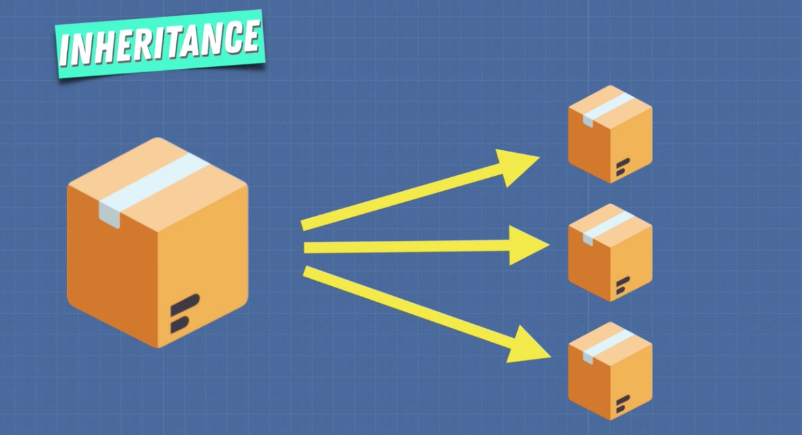

# Object Oriented Programming

Object-oriented programming (OOP) is a programming paradigm based on the concept of "objects". In this way, the data structure becomes an object that includes both data and functions. Data, in the form of fields (often known as attributes or properties), and functions, in the form of procedures (often known as methods). 

A feature of objects is an object's procedures that can access and often modify the data fields of the object with which they are associated (objects have a notion of "this" or "self"). In addition, programmers can create relationships between one object and another. For example, objects can inherit characteristics from other objects.

In OOP, computer programs are designed by making them out of objects that interact with one another. OOP languages are diverse, but the most popular ones are class-based, meaning that objects are instances of classes, which also determine their types.


In OOP an object is a box containing information and operations that are supposed to refer to the same concept. It's like we're modeling real world objects and relationships.

## Class-based vs Prototype-based

When it comes to object oriented programming there are two main types of languages:  

- #### Class based

In class-based languages the classes are defined beforehand and the objects are instantiated based on the classes. If two objects <i>apple</i> and <i>orange</i> are instantiated from the class <i>Fruit</i>, they are inherently fruits and it is guaranteed that you may handle them in the same way. E.g. a programmer can expect the existence of the same attributes such as <i>color</i> or <i>sugar_content</i> or <i>is_ripe</i>.

- #### Prototype based

In prototype-based languages the objects are the primary entities. No classes even exist. The prototype of an object is just another object to which the object is linked. Every object has one prototype link (and only one).

New objects can be created based on already existing objects chosen as their prototype. You may call two different objects <i>apple</i> and <i>orange</i> a <i>fruit</i>, if the object <i>fruit</i> exists, and both <i>apple</i> and <i>orange</i> have <i>fruit</i> as their prototype. The idea of the <i>fruit</i> class doesn't exist explicitly, but as the equivalence class of the objects sharing the same prototype. The attributes and methods of the prototype are delegated to all the objects of the equivalence class defined by this prototype. The attributes and methods owned individually by the object may not be shared by other objects of the same equivalence class; e.g. the attribute <i>sugar_content</i> may be unexpectedly not present in <i>apple</i>. Only single inheritance can be implemented through the prototype.

### <i>Example</i>:

Let's create characters for a game using OOP:


## Factory Functions

Factory Functions, as the name suggests, are functions that act like factories. They create objects for us.

```javascript
function createElf(name, weapon) {
    return {
        name, // ES6 syntax (if prop & val are the same). Same as writing 'name: name'
        weapon,
        attack() {
            return 'attack with ' + weapon
        }
    }
}

const peter = createElf('Peter', 'stones')
peter.attack() // -> attack with stones
```

#### Using `Object.create()`:

The `Object.create()` method creates a new object, using an existing object as the prototype for the newly created object.

```javascript
const elfFunctions = {
    attack() {
        return 'attack with ' + this.weapon
    }
}

function createElf(name, weapon) {
    let newElf = Object.create(elfFunctions)
    newElf.name = name;
    newElf.weapon = weapon;
    return newElf;
}

const peter = createElf('Peter', 'stones')
peter.attack() // -> attack with stones
```

#### Using Constructor Functions:

Objects of the same type are created by calling the constructor function with the `new` keyword. By default the `new` keyword returns an object.

In JavaScript, the thing called `this` is the object that "owns" the code. The value of `this`, when used in an object, is the object itself. This is because the execution context changes after an object is created. In a constructor function `this` does not have a value. It is a substitute for the new object. The value of `this` will become the new object when a new object is created.

<i>Note that `this` is not a variable. It is a keyword. You cannot change the value of `this`.</i>

As a rule all constructor functions should start with a capital letter to let other programmers know that you need to call this function using the `new` keyword.

To add properties to a constructor function you must prepend them with `this`.

```javascript
function Elf(name, weapon) {
    this.name = name;
    this.weapon = weapon;
}

Elf.prototype.attack = function() {
    return 'attack with ' + this.weapon
}

const peter = new Elf('Peter', 'stones')
peter.name // -> Peter
peter.attack() // -> attack with stones

const sam = new Elf('Sam', 'fire')
sam.attack() // -> attack with fire
```

Constructor functions have access to the `prototype` property which we have the ability to attach methods to. 

Peter doesn't have `attack` as it's own method but when `Peter.attack()` gets called it's going to go up the prototype chain and access the `attack` method there. It can do this because the `Elf` constructor's prototype contains the `attack` method, so now both Peter and Sam are able to use it.

This is efficient because `attack` now exists in the same location in memory and we now no longer have to copy it multiple times in order to use it.

<i>Note: Remember, we can't use arrow functions in constructors because arrow functions are lexically scoped and will point the value of `this` back to the function itself where it was written.</i>

#### Using ES6 Classes

Constructor functions inside classes get run every time we instantiate the class.

```javascript
class Elf {
    constructor(name, weapon) {
        this.name = name;
        this.weapon = weapon;
    }
    attack() {
        return 'attack with ' + this.weapon
    }
}

const peter = new Elf('Peter', 'stones')
peter.attack() // -> attack with stones

console.log(peter instanceof Elf) // -> true
```

<i>Note: In JavaScript ES6 classes are syntactic sugar. Under the hood they are still technically using prototypal inheritance. JavaScript classes are still technically objects.</i>

---
<br>

## More of `this`

#### Implicit Binding

```javascript
const person = {
    name: 'Corey',
    age: 26,
    hi() {
        console.log('Hi ' + this.name)
    }
}

person.hi() // -> Hi Corey
```

#### Explicit Binding: with `call()`

We know that in order to tell what the this keyword is referencing we first have to look at where the function is being invoked. Now, this brings up the question, how can we invoke greet but have it be invoked with the `this` keyword referencing the person object. We can’t just do person.greet() like we did before because person doesn’t have a greet method. In JavaScript, every function contains a method which allows you to do exactly this and that method is named `call()`. `call()` is a method on every function that allows you to invoke the function specifying in what context the function will be invoked.

Again, `call()` is a property on every function and the first argument you pass to it will be the context (or the focal object) in which the function is invoked. In other words, the first argument you pass to call will be what the `this` keyword inside that function is referencing.

```javascript
function greet(lang1, lang2, lang3) {
  console.log(`Hello, my name is ${this.name} and I know ${lang1}, ${lang2} & ${lang3}.`)
}

const person = {
    name: 'Corey',
    age: 26
}

greet.call(person, 'JavaScript', 'PHP', 'Ruby')
// -> Hello, my name is Corey and I know JavaScript, PHP & Ruby.
```

#### Explicit Binding: with `apply()`

`apply()` is the exact same thing as `call()`, but instead of passing in arguments one by one, you can pass in a single array and it will spread each element in the array out for you as arguments to the function.

```javascript
function greet(lang1, lang2, lang3) {
  console.log(`Hello, my name is ${this.name} and I know ${lang1}, ${lang2} & ${lang3}.`)
}

const person = {
    name: 'Corey',
    age: 26
}

const languages = ['JavaScript', 'PHP', 'Ruby']

greet.apply(person, languages)
// -> Hello, my name is Corey and I know JavaScript, PHP & Ruby.
```

#### Explicit Binding: with `bind()`

`bind()` is the exact same as `call()` but instead of immediately invoking the function, it’ll return a new function that you can invoke at a later time. Therefore we should save it to a variable.

```javascript
function greet(lang1, lang2, lang3) {
  console.log(`Hello, my name is ${this.name} and I know ${lang1}, ${lang2} & ${lang3}.`)
}

const person = {
    name: 'Corey',
    age: 26
}

const greeting = greet.bind(person, 'JavaScript', 'PHP', 'Ruby')

greeting() // -> Hello, my name is Corey and I know JavaScript, PHP & Ruby.
```

#### `new` Binding

The third rule for figuring out what the this keyword is referencing is called the `new` binding. Whenever you invoke a function with the `new` keyword, under the hood, the JavaScript interpreter will create a brand new object for you and call it `this`. So, naturally, if a function was called with `new`, the `this` keyword is referencing that new object that the interpreter created.

```javascript
function Person(name, age) {
  /*
    Under the hood, JavaScript creates a new object called `this`
    which delegates to the Person's prototype on failed lookups. If a
    function is called with the new keyword, then it's this new object
    that the interpreter created that the this keyword is referencing.
  */

  this.name = name
  this.age = age
}

const me = new Person('Corey', 26)
```

#### Lexical Binding

With arrow functions, `this` is determined “lexically”. Arrow functions don’t have their own `this`. Instead, just like with variable lookups, the JavaScript interpreter will look to the enclosing (parent) scope to determine what `this` is referencing.

```javascript
const person = {
  name: 'Corey',
  age: 26,
  languages: ['JavaScript', 'PHP', 'Ruby'],
  
  greet() {
    const hello = `Hello, my name is ${this.name} and I know `

    const langs = this.languages.reduce((str, lang, i) => {
      if (i === this.languages.length - 1) {
        return `${str} and ${lang}.`
      }
      return `${str} ${lang},`
    })

    console.log(hello + langs)
  }
}

person.greet() // -> Hello, my name is Corey and I know JavaScript PHP, and Ruby.
```

#### window Binding

When we’re not using `call`, `apply`, `bind`, or the `new` keyword, by default `this` will reference the `window` object. What that means is if we add an age property to the `window` object, then when we invoke our sayAge function, `this.age` will be whatever the age property is on the `window` object.

```javascript
age = 26

function sayAge() {
  console.log(`My age is ${this.age}`)
}

sayAge() // -> my age is 26
```

---
<br>

## Inheritance




Here we're going to create a base (super) class of Character and then create a sub class of Elf which will extend Character, inheriting it's properties. Elf will now have a prototype of Character.

The constructor within the Elf class exists only within Elf. If we want to set any properties within this constructor using the `this` keyword, we have to use the `super` keyword to call the superclass first. In doing so `super` will run the constructor and give us an instance of the Character base class. The `this` keyword will now refer to that instance, and we can now add on additional properties for the Elf subclass.

```javascript
class Character {
    constructor(name, weapon) {
        this.name = name;
        this.weapon = weapon;
    }
    attack() {
        return 'attack with ' + this.weapon;
    }
}

class Elf extends Character {
    constructor(name, weapon, type) {
        super(name, weapon);
        this.type = type;
    }
}

class Ogre extends Character {
    constructor(name, weapon, colour) {
        super(name, weapon);
        this.colour = colour;
    }
    makeFort() {
        return 'Strong fort made';
    }
}

const dobby = new Elf('dobby', 'cloth', 'house');

const shrek = new Ogre('shrek', 'club', 'green');
shrek.makeFort() // -> Strong fort made
```

---
<br>

## Public & Private - Protected properties and methods

<i>[Reference Article](https://javascript.info/private-protected-properties-methods)</i>

### Internal and external interface

In object-oriented programming, properties and methods are split into two groups:

<b>Internal interface</b> – Methods and properties are accessible from other methods of the class, but not from the outside.

<b>External interface</b> – Methods and properties are accessible also from outside the class.

In JavaScript, there are two types of object fields (properties and methods):

<b>Public:</b> accessible from anywhere. They comprise the external interface. Till now we were only using public properties and methods.

<b>Private:</b> accessible only from inside the class. These are for the internal interface.

<br>

#### <i>Example:</i> Let's make a coffee machine

```javascript
class CoffeeMachine {
    waterAmount = 0;

    constructor(power) {
        this.power = power;
        console.log(`Created a coffee machine. Power: ${power}.`)
    }
}

const nespresso = new CoffeeMachine(100);
// -> Created a coffee machine. Power: 100.

nespresso.waterAmount = 200;
```

#### Protected properties

Now let’s make the `waterAmount` property protected so we have more control over it. For instance, we don’t want anyone to set it below zero.

Protected properties are usually prefixed with an underscore `_`.

```javascript
class CoffeeMachine {
    _waterAmount = 0;

    set waterAmount(value) {
        if (value < 0) throw new Error('Negative water');
        this._waterAmount = value;
    }

    get waterAmount() {
        return this._waterAmount;
    }

    constructor(power) {
        this.power = power;
        console.log(`Created a coffee machine. Power: ${power}.`)
    }
}

const nespresso = new CoffeeMachine(100);
// -> Created a coffee machine. Power: 100.

nespresso.waterAmount = -50; // -> Uncaught Error: Negative water
```

#### Read-only properties

Let’s make the `power` property read-only. 

Some properties will be set at creation time and never modified. That’s exactly the case for a coffee machine: power never changes.

To do so, we only need to make getter, but not the setter:

```javascript
class CoffeeMachine {
    _waterAmount = 0;

    set waterAmount(value) {
        if (value < 0) throw new Error('Negative water');
        this._waterAmount = value;
    }

    get waterAmount() {
        return this._waterAmount;
    }

    constructor(power) {
        this._power = power;
    }

    get power() {
        return this._power;
    }
}

const nespresso = new CoffeeMachine(100);

console.log(`Power is: ${nespresso.power}W`); // -> Power is 100W

nespresso.power = 250; // -> Error (no setter)
```

#### Private properties

<i>Note: Not yet universally supported.</i>

There’s a finished JavaScript proposal, almost in the standard, that provides language-level support for private properties and methods.

Privates should start with `#`. They are only accessible from inside the class.

For instance, here’s a private `#waterLimit` property and the water-checking private method `#checkWater`:

```javascript
class CoffeeMachine {
  #waterLimit = 200;

  #checkWater(value) {
    if (value < 0) throw new Error("Negative water");
    if (value > this.#waterLimit) throw new Error("Too much water");
  }

}

let nespresso = new CoffeeMachine();

// can't access privates from outside of the class
nespresso.#checkWater(); // Error
nespresso.#waterLimit = 1000; // Error
```

On the language level, `#` is a special sign that the field is private. We can’t access it from outside or from inheriting classes.

Private fields do not conflict with public ones. We can have both private `#waterAmount` and public`#waterAmount` fields at the same time.

```javascript
class CoffeeMachine {

  #waterAmount = 0;

  get waterAmount() {
    return this.#waterAmount;
  }

  set waterAmount(value) {
    if (value < 0) throw new Error("Negative water");
    this.#waterAmount = value;
  }
}

let machine = new CoffeeMachine();

machine.waterAmount = 100;
alert(machine.#waterAmount); // Error
```

Unlike protected ones, private fields are enforced by the language itself. That’s a good thing. But if we inherit from `CoffeeMachine`, then we’ll have no direct access to `#waterAmount`. We’ll need to rely on `waterAmount` getter/setter. In many scenarios such limitation is too severe. If we extend a `CoffeeMachine`, we may have legitimate reason to access its internals. That’s why protected fields are used more often, even though they are not supported by the language syntax.

---
<br>

## 4 Pillars of OOP


### 1. Encapsulation

Encapsulation, in object-oriented programming, is the bundling of data with the methods that operate on it, or the restricting of direct access to some of an object's components. Encapsulation is used to hide the values or state of an object inside a class, preventing direct access to them. Publicly accessible methods are generally provided in the class (getters and setters) to access the values, and other classes call these methods to retrieve and modify values within the object.

### 2. Abstraction

Abstraction is the process of taking away characteristics from something in order to reduce it to a set of essential characteristics. Through the process of abstraction, a programmer hides all but the relevant data about an object in order to reduce complexity and increase efficiency. 

Objects in an OOP language provide an abstraction that hides the internal implementation details. Similar to the coffee machine in your kitchen, you just need to know which methods of the object are available to call and which input parameters are needed to trigger a specific operation. But you don’t need to understand how this method is implemented and which kinds of actions it has to perform to create the expected result.

### 3. Inheritance

In object-oriented programming, inheritance enables new objects to take on the properties of existing objects. A class that is used as the basis for inheritance is called a superclass or base class. A class that inherits from a superclass is called a subclass or derived class.

Inheritance is the mechanism of basing an object or class upon another object (prototype-based inheritance) or class (class-based inheritance) to create a new implementation while maintaining the same behaviors. Also defined as deriving new classes from existing ones and forming them into a hierarchy of classes. In most class-based object-oriented languages, an object created through inheritance (child object) acquires all the properties and behaviors of the parent object (except for constructors).

### 4. Polymorphism

Polymorphism is an object-oriented programming concept that refers to the ability of a variable, function or object to take on multiple forms. A language that features polymorphism allows developers to program in the general rather than program in the specific.

More specifically, it is the ability to redefine methods for derived classes. For example, given a base class <i>shape</i>, polymorphism enables the programmer to define different <i>area</i> methods for any number of derived classes, such as circles, rectangles and triangles. No matter what <i>shape</i> an object is, applying the <i>area</i> method to it will return the correct results.

```javascript
class Character {
    constructor(name, weapon) {
        this.name = name;
    }
    attack() {
        return 'attack with ' + this.weapon;
    }
}

class Elf extends Character {
    constructor(name, type) {
        super(name);
        this.type = type;
    }
    attack(spell) {
        return this.name + ` attacked by casting a ${spell} spell.`;
    }
}

class Ogre extends Character {
    constructor(name, colour) {
        super(name);
        this.colour = colour;
    }
    attack(type, weapon) {
        return this.name + ` used the ${type} attack with a ${weapon}.`;
    }
}

const dobby = new Elf('Dobby', 'House Elf');
dobby.attack('voodoo'); // -> Dobby attacked by casting a voodoo spell.

const shrek = new Ogre('Shrek', 'green');
shrek.attack('smash', 'club'); // -> Shrek used the smash attack with a club.
```

In this simple example of polymorphism we're doing <i>method overwriting</i>, where the same method acts differently for each type of class, as well as <i>method overloading</i>, where extra features or parameters are added to a method to extend its functionality. 

So the overarching idea with polymorphism in object oriented programming is the ability to process objects differently depending on their datatype or class. Because JavaScript is a dynamically typed language it actually limits the amount of polymorphism we can achieve, but the idea is still the same.

The ability to reuse functionality and customize methods to certain objects is efficient and means we don't need to copy and repeat code.