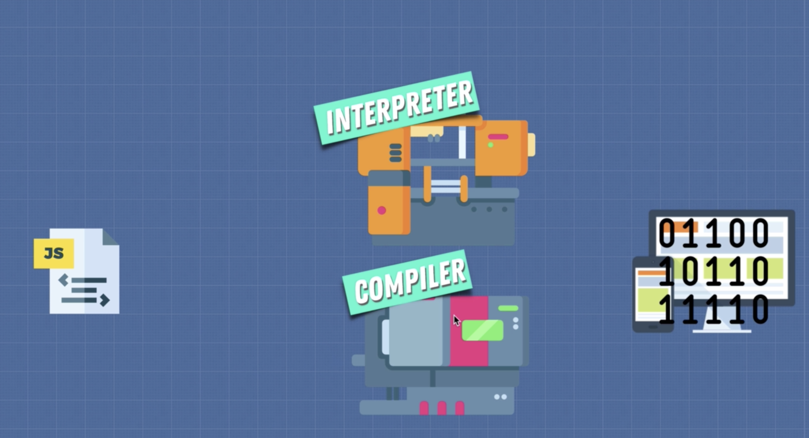
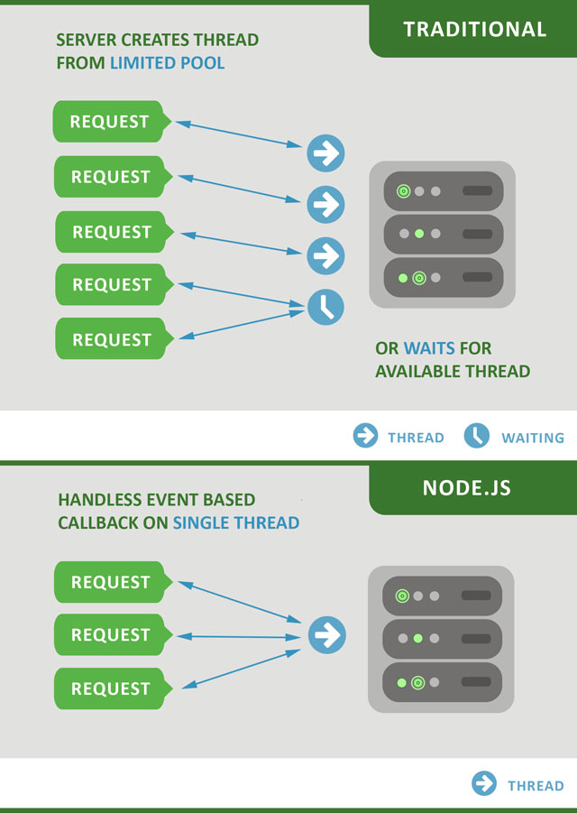
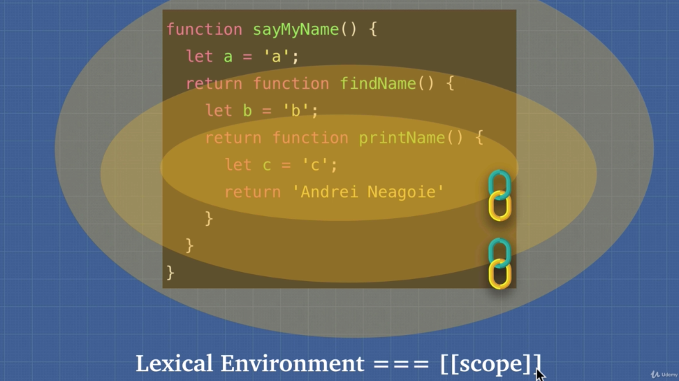
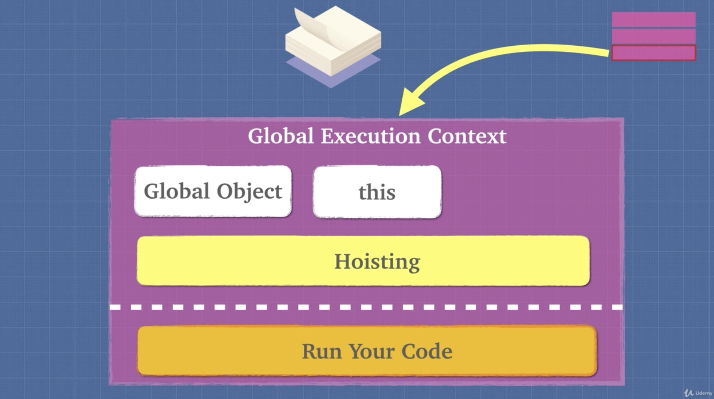

# JavaScript Foundations

## JavaScript engine

A JavaScript engine is a program that translates JavaScript into machine language so that it can be interpreted by a computer.

JS Engines were written to improve the performace of JavaScript in the browser.

This documentation alalyses the [V8 Chrome Engine](https://v8.dev).

### <b>How it works:</b>


1. The engine receives a JS file
1. The JS syntax is broken down into a series of tokens (a process called Lexical Analysis)
1. The tokens are then formed into an abstract syntax tree (AST)
1. It is then passed through an interpreter and converted into bytecode
1. The code is then run through a profiler and monitored for optimisation
1. Repetitive code is then passed through a JIT compiler and the associated byte code is replaced with optimised machine language

#### Simple example of Lexical Analysis:

```javascript
function jsengine(code) {
  return code.split(/\s+/);
}

jsengine("const x = 100");
// => ['const', 'x', '=', '100']
```

---



## Interpreter

Interpreters read and execute code line by line.

JavaScript was originally designed for the browser, so interpreters were ideal for running it as fast as possible. The issue with Interpreters however is that they are slow at executing loops.

<b>Pros:</b> Quick to get up and running </br>
<b>Cons:</b> Slow at executing loops and repetitive code

---

## Compiler

Compilers essentially translate our code and compile it down into machine language.

They're faster at processing loops because they have the ability to analyse and optimise code withing repeating translations on each pass.

<b>Pros:</b> Takes a bit longer to get up and running </br>
<b>Cons:</b> Code eventually runs faster

<i>

- [<b>Babel</b>](https://babeljs.io) is a Javascript compiler that takes your modern JS code and returns browser compatible JS (older JS code).

- [<b>Typescript</b>](https://www.typescriptlang.org) is a superset of Javascript that compiles down to Javascript.

Both of these do exactly what compilers do: Take one language and convert into a different one!

</i>

### <b>JIT Compiler</b>

JIT (Just in time) compilers are essentially the combination of an interpreter and a compiler. They were designed to make JS Engines run faster.

---

## ECMAScript

ECMAScript is the governing body which sets the standardised rules for JS engines

[List of ECMAScript engines](https://en.wikipedia.org/wiki/List_of_ECMAScript_engines)

---

## <i>"JS is an interpreted language"</i>

You often hear JavaScript being refered to as an 'interpreted language'.

This is technically true, but not always true. Essentially, it depends on the implementation.

JavaScript can be executed by being run only through an interpreter, and it can also be executed being run only through a compiler.

Initially when JavaScript first came out, engines such as Spider Monkey only used interpreters to convert to byte code and run in the browser.

Today, modern JS Engines have evolved to include compilers for optimisation.

---

## Writing optimised code

Part of being a good JavaScript developer includes writing code in a way that helps the compiler make optimizations. Code that is predictable is not only easier for people to understand, but easier for computers as well.

Be careful when using the following functions as they can affect the JS engine's optimisation:

- eval()
- arguments (object)
- for in
- with
- delete

---

## Inline Caching

Inline caching is an optimization technique employed by V8. The goal is to speed up runtime method binding by remembering the results of a previous method lookup directly at the call site. JavaScript engines use IC to memorize information on where to find properties on objects, to reduce the number of timely lookups.

---

## Hidden Classes

JavaScript is a dynamic language. Data type is determined at the time of execution, making accessing object properties fairly slow, in comparison to statically typed languages. It’s rather hard to optimize a dynamically typed language. Objects can change their type during runtime and it happens implicitly. To track types of JavaScript object and variables, V8 introduced the concept of hidden classes. During runtime V8 creates hidden classes that get attached to each and every object containing memory for each property. This allows for V8 to optimize the property access time.

It's important to write performant, predictable code which doesn't impede the engine's ability to form patterns when generating hidden classes.

<i>Tips:</i>

- Assign all properties of an object within it's constructor
- Instantiate object properties in the same order

---

## Call Stack

A call stack is a mechanism for an interpreter to keep track of its place in a script that calls multiple functions — what function is currently being run and what functions are called from within that function, etc.

You can think of the call stack as a region in memory which operates in 'first in, last out' mode. It stores functions and variables as your code executes.

- When a script calls a function, the interpreter adds it to the call stack and then starts carrying out the function.
- Any functions that are called by that function are added to the call stack further up, and run where their calls are reached.
- When the current function is finished, the interpreter takes it off the stack and resumes execution where it left off in the last code listing.
- If the stack takes up more space than it had assigned to it, it results in a "stack overflow" error.

---

## <b>Memory Heap</b>

In most native executable programs, there are two types of memory available: stack-based and heap-based memory.

The heap is reserved for the memory allocation needs of the program. It is an area apart from the program code and the stack which stores program data in an unordered fashion.

### <b>Garbage Collection</b>

JavaScript is a garbage collected language. Data stored in the memory heap that isn't needed anymore gets cleared away to preserve memory. This helps prevent memory leaks.

Garbage collection in JS uses the 'mark and sweep' algorithm. Essentially it marks data which is being used and needs to be kept, and sweeps away data which is no longer being used or referenced.

### <b>Memory Leaks</b>

A memory leak occurs when a computer program incorrectly manages memory allocations in such a way that memory which is no longer needed is not released. This is often due to unintentional references from other objects. Memory leaks in web pages often involve interaction between JavaScript objects and DOM elements.

A memory leak may also happen when an object is stored in memory but cannot be accessed by the running code.

<b>Common causes of memory leaks to avoid:</b>

- <b>Global variables:</b> Using too many global variables can add excessive amounts of data to memory which doesn't get cleared away.
- <b>Event Listeners:</b> Unregistered event listeners can cause memory leaks because any objects referenced by them can't be garbage collected. Memory leaks often occur after a lot of user interaction.
- <b>Set Interval:</b> Unless stopped, the objects within setInterval() are never garbage collected becuase the function keeps running.

---

## JavaScript Runtime

Think of the JS runtime environment as a big container. Within the big container are other smaller containers. As the JS engine parses the code it starts putting pieces of it into different containers.


JavaScript is a single-threaded language, meaning only one set of instructions can be executed at a time. This is because JavaScript engines only have one call stack.

The JS Runtime Environment executes asynchronous code in the background and uses the web browser API to communicate with the JS engine.

All modern browsers have a JS engine as well as a JS runtime which provides a web API.

### <b>Web Browser API</b>

Web API's are applications provided by the browser which can do a variety of tasks in the background such as sending HTTP requests, listening to DOM events, caching and database storage on the browser.

### <b>The Heap</b>

The first container in the environment, which is also part of the V8 JS Engine, is called the ‘memory heap.’ As the V8 JS Engine comes across variables and function declarations in the code it stores them in the Heap.

### <b>The Stack</b>

The second container in the environment is called the ‘call stack.’ It is also part of the V8 JS Engine. As the JS Engine comes across an actionable item, like a function call, it adds it to the Stack.

Once a function is added to the Stack the JS engine jumps right in and starts parsing its code, adding variables to the Heap, adding new function calls to the top of the stack, or sending itself to the third container where Web API calls go.

When a function returns a value, or is sent to the Web API container, it is popped off the stack and moves to the next function in the stack. If the JS Engine gets to the end of the function and no return value is explicitly written, the JS Engine returns undefined and pops off the function from the stack. This process of parsing a function and popping it off the stack is what they mean when they say Javascript runs synchronously. It does one thing at a time on a single thread.

<i>Note - the Stack is a data structure that runs LIFO — last in first out. No function other than the one at the top of the stack will ever be in focus, and the engine will not move to the next function unless the one above it is popped off.</i>

### <b>The Web API Container</b>

The Web API calls that were sent to the Web API container from the Stack, like event listeners, HTTP/AJAX requests, or timing functions, sit there until an action is triggered. Either a ‘click’ happens, or the HTTP request finishes getting its data from its source, or a timer reaches its set time. In each instance, once an action is triggered, a ‘callback function’ is sent to the fourth and final container, the ‘callback queue.’

### <b>The Callback Queue</b>

The Callback Queue will store all the callback functions in the order in which they were added. It will ‘wait’ until the Stack is completely empty. When the Stack is empty it will send the callback function at the beginning of the queue to the Stack. When the Stack is clear again, it will send over its next callback function.

<i>Note - the Queue is a data structure that runs FIFO — first in first out. Whereas the Stack uses a push and pop (add to end take from end), the Queue uses push and shift (add to end take from beginning).</i>

### <b>The Event Loop</b>

The Event Loop can be thought of as a ‘thing’ inside the javascript runtime environment. It's job is to constantly look at the Stack and the Queue. If it sees the Stack is empty, it will notify the Queue to send over its next callback function. The Queue and the Stack might be empty for a period of time, but the event loop never stops checking both. At any time a callback function can be added to the Queue after an action is triggered from the Web API container.

<br>

<b>This is what they mean when they say Javascript can run asynchronously. It isn’t actually true, it just seems true.

Javascript can only ever execute one function at a time, whatever is at top of the stack, it is a synchronous language. But because the Web API container can forever add callbacks to the queue, and the queue can forever add those callbacks to the stack, we think of javascript as being asynchronous.

This is really the great power of the language. Its ability to be synchronous, yet run in an asynchronous manner, like magic!</b>

---

## Node.js


Node.js is a JavaScript runtime environment which includes everything you need to execute a program written in JavaScript.

Node.js came into existence when the original developers of JavaScript extended it from something you could only run in the browser to something you could run on your machine as a standalone application. Node.js’ package ecosystem, npm, is the largest ecosystem of open source libraries in the world.

This provided JavaScript with the capability of doing things that other scripting languages like Python can do.

Both browser JavaScript and Node.js run on the V8 JavaScript runtime engine.

Node has a 'Global' API (similar to web browser's 'Window' API) which provides more functions than a browser.

Node.js is a server side platform which uses an event-driven, asynchronous, non-blocking I/O model that makes it lightweight and efficient.

<i>I/O refers to input/output. It can be anything ranging from reading/writing local files to making an HTTP request to an API. I/O takes time and hence blocks other functions.</i>

This runtime that runs outside of the browser allows us to have the same model of a single threaded model but any asynchronous tasks can be non-blocking. They are passed on to what we call worker threads in the background to do the work for us and then get sent back through the callback queue and event loop onto the stack.

<i>Node.js vs PHP / Python</i>



The main difference between the Node.js approach and a Python threaded-server is that Node.js is single threaded while the latter is multithreaded. More specifically, the latter will typically dedicate one thread per request. If, in the handling of that request, you need to do something slow like connect to a remote database, the thread will sleep until the slow thing is done and the rest of the logic is ready to proceed. This can be time consuming and can result in threads maxing out.

In contrast, the Node.js approach is to schedule callbacks that are to be invoked once the slow thing is done. Node.js' single thread is never sleeping except if there are literally no requests to process. The code runs in a persistent context that exists as long as your Node.js server is running.

---

## Lexical Environment

Lexical Environment is the environment of the function where it is written. That is, the static order/place where it is situated, regardless from where it is called from.

In JavaScript our lexical scope (available data & variables where the function was defined) determines our available variables. Not where the function is called (dynamic scope).



---

## Scope

Scope of a variable/function is basically the locations from where a variable is visible/accessible. In JavaScript there are two types of scope:

- <b>Local scope:</b> Variables defined inside a function are not accessible (visible) from outside the function. They become LOCAL to the function. JavaScript has function scope: Each function creates a new scope.
- <b>Global scope:</b> A variable declared outside a function, becomes GLOBAL. A global variable has global scope: All scripts and functions on a web page can access it.

---

## Execution Context

Execution context is defined as the environment in which JavaScript code is executed. In JavaScript environment there are 2 main types of Execution Context:

#### Global Execution Context

This is the default execution context in which JS code start its execution when the file first loads in the browser. All the global code are executed inside global execution context. Global execution context cannot be more than one because only one global environment is possible for JS code execution.

#### Functional execution context

Functional execution context is defined as the context created by the execution of code inside a function. Each function has its own execution context. It can be more than one. Functional execution context have access to all the code of global execution context. While executing global execution context code, if JS engine finds a function call, it creates a new functional execution context for that function.

The execution context/environment of a function roughly equates to:

- Arguments sent to that function
- The scope chain of that function i.e. variables and objects available for the function to use
- Value of `this`

---

## Hoisting

Hoisting is the behavior of moving variables or function declarations to the top of their respective environments during the compilation phase. The JavaScript engine allocates memory for the variables and functions that it sees in your code during the creation phase, even before the code is run.

Variables are partially hoisted. Variable names are hoisted but not their value. Functions on the other hand are fully hoisted.

Only `var` and `function` are hoisted.

Function declarations get hoisted, but function expressions don't. Function expressions get defined at runtime when they're invoked, where as function declarations get defined at parse time - when the compiler first looks at the code & hoists.

```
// Function Expression
var canada = function() {
  console.log('cold)
}

// Function Expression
var canada = () => {
  console.log('cold)
}

// Function Declaration
function australia() {
  console.log('warm)
}
```

Hoisting can lead to confusing code and it is considered best practice to avoid using it. So instead of using `var`, use `const` and `let` (ES6 syntax).



To review, with the global execution context we have a few things that happen. We have the `Global` object and the `this` object during the creation phase that gets assigned, and then during the execution phase we run our code.

But it's important to remember that during this creation phase we also have this act of hoisting, something that's quite unique to JavaScript where anytime we see the `function` or the `var` keywords as the first items on the line, we allocate space for them in our heap to make sure that the JavaScript engine is ready for the execution.

#### A Deeper Dive into Execution Contexts

Execution context works as a unit in the overall flow of execution. Since every function has its own execution context, the JS compiler maintains a stack of execution contexts. It tracks whether the execution contexts are in the correct order. The top of the stack contains the execution context of the function that is currently being executed.

---

## Scope Chain

Every scope is always connected to one or more scopes in their back forming a chain or a hierarchy, except the global scope. The global scope does not have any parent, and that makes sense too since it is sitting at the top of the hierarchy.

The scope chain is always created lexically (from where it was written). The parents of a scope are defined by where the execution context (function) lie lexically or physically in the code.

#### How is the scope chain used by the compiler?

Whenever the compiler encounters a variable or an object, it traverses the whole scope chain of the current execution context looking for it. If it is NOT found there, it traverses the prototype chain, if it is NOT found there either it throws an undefined error.

Remember, Javascript is single-threaded. There is always only one execution context being executed at a time. So is is important to understand how the Javascript compiler handles resources.

#### To review:

- Every function has its own execution context.
- The execution context is the environment of a function which includes it's own scope.
- The compiler creates the scope of a function by looking at where it is placed in the code.
- The compiler creates a hierarchy of scopes called scope-chain. Global scope sits at the top of this hierarchy.
- The compiler looks at the scope-chain backward when a variable is used in the code. If it is not found it throws an undefined error.

<i>Example:</i>

```javascript
const hello = function name() {
  return "Hey Corey";
};

hello(); // => Hey Corey

name(); // => Reference error

// name() only exists within the function scope of hello()
```

#### Errors:

<b>Undefined:</b> Remember `undefined` is an actual type in JavaScript. It means 'yes we have this variable but it's not assigned anything right now'.

<b>Reference Error:</b> This error basically means 'this is completely undeclared, scope chain can't find it'.

#### Tip:

Avoid using the `eval()` function and the `with` statement because they can interfere with the JavaScript engine's ability to optimize our code. This is because they can actually manipulate scope and scope chains, which will conflict with the compiler's ability to read our code.

---

## This

#### `this` is the object that the function is a property of

What's the purpose of `this`?

- It gives methods access to their object

<i>Example:</i>

```javascript
const object = {
  name: "Corey",
  greet() {
    return "Hello " + this.name;
  },
  welcome() {
    return this.greet() + ", have a nice day!";
  }
};

object.greet(); // => 'hello Corey'

object.welcome(); // => 'Hello Corey, have a nice day!'
```

- It provides the ability to execute the same code for multiple objects

<i>Example:</i>

```javascript
function startCar() {
  console.log("The " + this.car + " is running");
}

const car = "Ford";

const object1 = {
  car: "Audi",
  startCar: startCar
};

const object2 = {
  car: "BMW",
  startCar: startCar
};

startCar(); // => "The Ford is running" (The global window is running the function)

object1.startCar(); // => "The Audi is running" (The object is running the function)
```

---

## `call()`, `apply()`, `bind()`

JavaScript has a number of built in function/methods that can apply to various data types. These 3 functions are all designed to set CONTEXT, or more specifically, what “this” refers to.

#### `call()`

With the `call()` method, you can write a method that can be used on different objects. It can take parameters and pass in arguments:

```javascript
const bus = {
  make: "Scania",
  fuel: 80,
  reFuel(tank1, tank2) {
    return (this.fuel += tank1 + tank2);
  }
};

const truck = {
  make: "Mack",
  fuel: 20
};

truck.fuel; // => 20

bus.reFuel.call(truck, 100, 40);

truck.fuel; // => 160
```

#### `apply()`

Using `.apply()` is very similar to `.call()`. The only difference is that `.call()` takes arg1 and arg2 just one after another.
For `.apply()` to work, arguments 1 and 2 need to be entered as an array:

```javascript
bus.reFuel.apply(truck, [100, 40]);

truck.fuel; // => 160
```

#### `.bind()`

`.bind()`, unlike `.apply()` and `.call()`, returns a function instead of a value. `.bind()` sets the value of this and changes the function to a new function, but it doesn’t invoke the function. It also accepts comma separated arguments, similar to `.call()`.

`.bind()` is generally used when you want to call the function later on, or in a different context:

```javascript
const refuelTruck = bus.reFuel.bind(truck, 100, 40);

truck.fuel; // => 20

refuelTruck();

truck.fuel; // => 160
```

<i>Summary:</i>

`.call()` and `.apply()` are useful for borrowing methods from an object, while `.bind()` is useful to call functions later on with a certain context or a certain `this` keyword.

---

## Function Currying

Currying is the process of taking a function with multiple arguments and returning a series of functions that take one argument and eventually resolve to a value.

```javascript
function multiply(a, b) {
  return a * b;
}

let multiplyByTwo = multiply.bind(this, 2);

multiplyByTwo(4); // => 8
```

---

## Context vs Scope

Scope pertains to the visibility of variables, and context refers to the object to which a function belongs.

<b>Scope</b> has to do with the the visibility of variables. In JavaScript, scope is achieved through the use of functions. When you use the keyword `var` inside of a function, the variable that you are initializing is private to the function, and cannot be seen outside of that function.

<b>Context</b> is related to objects. It refers to the object to which a function belongs. When you use the JavaScript `this` keyword, it refers to the object to which the function belongs.
