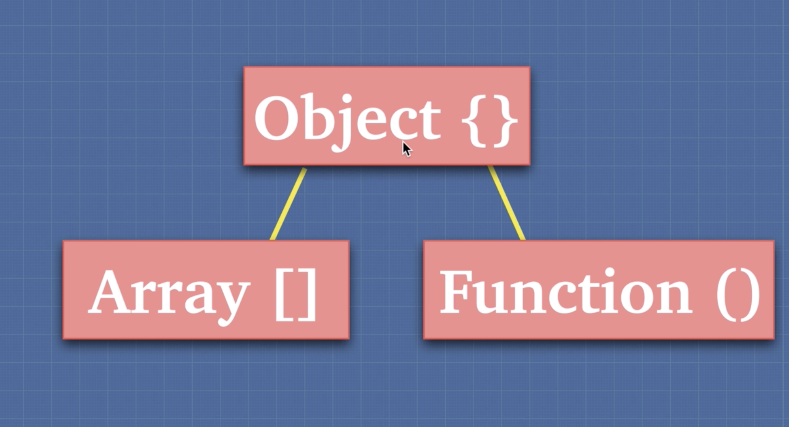

# Data Types in JavaScript

There are seven basic data types in JavaScript.

## Primitive Types

Primitive types are data that only represent a single value. A variable of a primitive type directly contains the value of that type.

These six types are considered to be primitives. A primitive is not an object and has no methods of its own. All primitives are immutable.

#### 1. Number

```javascript
const num = 5;
const num = 12.34;
```

The number type represents both integer and floating point numbers

#### 2. String

```javascript
let str = "Hello";
```

A string in JavaScript must be surrounded by quotes.

#### 3. Boolean

The boolean type has only two values: `true` and `false`.

```javascript
let yes = true;
let no = false;
```

#### 4. Null

`null` is the absence of a value. It’s a special value which represents “nothing”, “empty”.

```javascript
let name = null;
```

#### 5. Undefined

`undefined` means “value is not assigned”. If a variable is declared, but not assigned, then its value is undefined.

```javascript
let x;
alert(x); // => "undefined"
```

#### 6. Symbol

The `symbol` type is used to create unique identifiers for objects.

```javascript
const symbol1 = Symbol("hello");
```

## Non Primitive Types

Everything else is an `object` type.

A non-primitive type doesn't contain the actual value directly. Instead it contains a reference to somewhere in memory where the value is stored.

#### 7. Object

The `object` type is special. All other types are called “primitive” because their values can contain only a single thing (be it a string or a number or whatever). In contrast, objects are used to store collections of data and more complex entities.

```javascript
const car = {
  make: "Ford",
  year: 2019
};
```



In JavaScript, arrays and functions are technically objects.

### <b>JS built-in objects</b>

[List of standard built-in objects](https://developer.mozilla.org/en-US/docs/Web/JavaScript/Reference/Global_Objects)

The term "global objects" (or standard built-in objects) is not to be confused with the global object. Here, global objects refer to objects in the global scope.

You may have heard the term <i>"everything in Javascript is an object"</i>. This quote references the fact that many (but not all) things we interact with directly in JavaScript such just strings, numbers and booleans (which are primitive) have object wrappers, such as `String()`, `Number()` and `Boolean()`. JavaScript does this to allow us to be able to use some methods on these primitive values.

<i>Example use-case:</i>

```javascript
true.toString(); // => 'true'
```

---

### How to check for an array?

Considering that behind the scenes arrays are technically objects, you can't use `typeof` to check if something is an array because even if it is it will return `object`.

<i>Example:</i>

```javascript
const arr = [1, 2, 3];
typeof arr; // => object
```

Therefore we use the `Array.isArray()` method to determine whether the passed value is an Array.

<i>Example:</i>

```javascript
const arr = [1, 2, 3];
Array.isArray(arr); // => true
```

---


## Pass By Value (primitives)

When assigning a variable (a) a primitive value the equals operator sets up a location (address) in memory to store the information and points the variable (a) to that address. When you create a new variable (b) and assign it the value of another variable (a) the equals operator creates ANOTHER spot in memory separate from the original variable and places of copy of (a) in the new variable's spot in memory. So, by value copies the value of the original variable (a) into two separate spots in memory.

<i>Example:</i>

```javascript
const a = 5;
const b = a;

console.log(a); // => 5
console.log(b); // => 5

a = 1;

console.log(a); // => 1
console.log(b); // => 5
```

## Pass by Reference (objects)

When a variable (a) is set equal to an object, the equals operator identifies that the value is an object, creates a new location in memory and points (a) to the address. When we create a new variable (b) and assign it the value of variable (a) the equals operator knows we are dealing with an object and points it to the same address that (a) points to. No new location or object in memory is created (like in pass by value), rather variable (b) is simply pointed to the same address that variable (a) was pointed to.

<i>Example:</i>

```javascript
let a = { name: "Corey" };
let b = a;

console.log(a); // => {name: "Corey"}
console.log(b); // => {name: "Corey"}

a.name = "Billy";

console.log(a); // => {name: "Billy"}
console.log(b); // => {name: "Billy"}
```

If you want to copy an object and create a new one which won't continue to reference the original object you can use the spread operator.

<i>Example:</i>

```javascript
let obj = { a: "a", b: "b", c: "c" };
let clone = { ...obj };

obj.c = 4;
console.log(clone); // => {a: 'a', b: 'b', c: 'c'}
```

Note: Any nested objects will still reference the original object using this method. Instead you can use `JSON.parse()` and `JSON.stringify()` to clone objects which contain nested objects. Avoid using this on large objects as it can cause performance issues.

<i>Example:</i>

```javascript
let obj = {
  a: "a",
  b: "b",
  c: {
    x: "x"
  }
};

let superClone = JSON.parse(JSON.stringify(obj));

obj.c.x = "y";

console.log(superClone); // => {a: 'a', b: 'b', c: { x: 'x'} }
```

---

## Type Coercion

Type coercion is the process of converting a value from one type to another (such as string to number, object to boolean, and so on). Any type, be it primitive or an object, is a valid subject for type coercion. In JavaScript type coercion occurs when you use the loose equality `==` operator.

As a general rule of thumb its best to avoid using the loose equality operator and instead use the strict equality operator `===`. This operator checks for equality without using type coercion, so the values must be equal in type as well.
